# Interactive HTML Diagram Generation

Complete guide for generating interactive, zoomable HTML diagrams with Claude Code.

---

## Overview

Every diagram generated by Claude Code can be converted to an **interactive HTML file** with:
- **Pan and Zoom**: Mouse wheel zoom, click and drag to pan
- **Keyboard Shortcuts**: Fast navigation and controls
- **Fit to Screen**: Automatic sizing for optimal viewing
- **Info Panel**: Description and related files
- **Professional Design**: Clean, modern interface

---

## Automatic HTML Generation

When Claude Code generates a diagram, it will automatically create **both** files:

1. **Markdown file** (for version control)
   - `claudedocs/diagrams/flowchart_login_2025-12-23.md`

2. **HTML file** (for interactive viewing)
   - `claudedocs/diagrams/flowchart_login_2025-12-23.html`

### Example Workflow

```
You: "Show me a flowchart for user login"

Claude Code generates:
  ✓ flowchart_login_2025-12-23.md   (Mermaid markdown)
  ✓ flowchart_login_2025-12-23.html (Interactive HTML)

You: Open the HTML file in browser → Interactive diagram with zoom!
```

---

## HTML Features

### 1. Pan and Zoom

**Mouse Controls**:
- **Zoom In/Out**: Scroll mouse wheel
- **Pan**: Click and drag anywhere on the diagram
- **Reset**: Click "Reset View" button

**Zoom Levels**:
- Minimum: 10% (0.1x)
- Maximum: 500% (5x)
- Step: 10% increments

### 2. Keyboard Shortcuts

| Key | Action |
|-----|--------|
| `+` or `=` | Zoom In |
| `-` | Zoom Out |
| `R` | Reset View |
| `F` | Fit to Screen |
| `I` | Toggle Info Panel |
| `?` | Show/Hide Keyboard Shortcuts |

### 3. Controls Bar

Top control bar includes:
- **Zoom In** button
- **Zoom Out** button
- **Reset View** button - Return to original position and scale
- **Fit to Screen** button - Automatically size diagram to viewport
- **Toggle Info** button - Show/hide description panel
- **Zoom Level** indicator - Current zoom percentage

### 4. Info Panel

Right side panel (toggle with `I` key) shows:
- **Description**: Natural language explanation of the diagram
- **Related Files**: Source files that were analyzed
- **Context**: Additional information

### 5. Responsive Design

- Adapts to window size
- Mobile-friendly (touch-enabled panning)
- Professional color scheme
- Clear typography

---

## Manual HTML Generation

If you only have the markdown file, you can generate HTML manually:

### Using Node.js Script

```bash
cd mermaid-claude
node utils/generate-html.js claudedocs/diagrams/flowchart_login_2025-12-23.md
```

This creates: `flowchart_login_2025-12-23.html` in the same directory.

### Custom Output Path

```bash
node utils/generate-html.js input.md output.html
```

---

## File Structure

```
claudedocs/diagrams/
├── flowchart_login_2025-12-23.md      # Markdown (version control)
├── flowchart_login_2025-12-23.html    # HTML (interactive view)
├── sequence_api-auth_2025-12-23.md
├── sequence_api-auth_2025-12-23.html
├── architecture_auth_2025-12-23.md
└── architecture_auth_2025-12-23.html
```

**Commit both files** to git:
- `.md` file for diffs and version tracking
- `.html` file for easy viewing by team members

---

## Opening HTML Files

### Option 1: Direct Browser Open
```bash
open claudedocs/diagrams/flowchart_login_2025-12-23.html
# Or double-click the file
```

### Option 2: Local Server (Recommended)
```bash
cd claudedocs/diagrams
python3 -m http.server 8000
# Open http://localhost:8000/flowchart_login_2025-12-23.html
```

### Option 3: VS Code Live Server
- Install "Live Server" extension
- Right-click HTML file → "Open with Live Server"

---

## Usage Examples

### Example 1: Architecture Diagram

**Request**: "Show me the auth module architecture"

**Files Generated**:
- `architecture_auth-module_2025-12-23.md`
- `architecture_auth-module_2025-12-23.html`

**HTML Features**:
- Zoom in to see class details
- Pan across large architecture
- Fit to screen for overview
- Info panel shows related source files

### Example 2: Complex Flowchart

**Request**: "Diagram the checkout process with error handling"

**Files Generated**:
- `flowchart_checkout_2025-12-23.md`
- `flowchart_checkout_2025-12-23.html`

**HTML Features**:
- Zoom to see decision points clearly
- Pan through entire flow
- Large diagram fits automatically
- Follow flow path with pan/zoom

### Example 3: Sequence Diagram

**Request**: "Show API authentication flow"

**Files Generated**:
- `sequence_auth-api_2025-12-23.md`
- `sequence_auth-api_2025-12-23.html`

**HTML Features**:
- Zoom to read message details
- Pan vertically through long sequences
- Clear participant separation
- Info panel explains each step

---

## HTML Template Customization

The HTML template is located at:
```
templates/diagram-template.html
```

### Customizable Elements

**Colors**:
- Header: `background: #2c3e50`
- Controls: `background: white`
- Buttons: `background: #3498db`

**Layout**:
- Header height: `80px`
- Controls bar: `60px`
- Info panel width: `400px`

**Behavior**:
- Zoom limits: `minScale: 0.1, maxScale: 5`
- Zoom step: `step: 0.1`
- Auto-fit on load: `setTimeout(fitToScreen, 1000)`

### Making Changes

1. Edit `templates/diagram-template.html`
2. Regenerate HTML files:
   ```bash
   node utils/generate-html.js diagram.md
   ```
3. Changes apply to new generations

---

## Advanced Features

### Auto-Fit on Load

HTML files automatically fit diagrams to screen on initial load:
```javascript
window.addEventListener('load', () => {
    setTimeout(fitToScreen, 1000);
});
```

### Responsive Zoom

Window resizing automatically refits diagrams at 100% zoom:
```javascript
window.addEventListener('resize', () => {
    if (currentZoom === 1) {
        fitToScreen();
    }
});
```

### Touch Support

Mobile/tablet friendly:
- Touch drag to pan
- Pinch to zoom
- Touch-optimized buttons

### Emoji Support

All HTML diagrams now support emojis with proper font rendering:

**System fonts configured:**
- Apple Color Emoji (macOS/iOS)
- Segoe UI Emoji (Windows)
- Noto Color Emoji (Linux/Android)

**Font configuration:**
```javascript
mermaid.initialize({
    fontFamily: '-apple-system, BlinkMacSystemFont, "Segoe UI", Roboto, "Apple Color Emoji", "Segoe UI Emoji", "Noto Color Emoji"'
});
```

**Example with emojis:**

```mermaid
flowchart TD
    Start([🚀 Start]) --> Check{🔐 Auth?}
    Check -->|✅ Yes| Success[✨ Done]
    Check -->|❌ No| Error[⚠️ Error]
```


**Works across all platforms:**
- ✅ macOS: Uses Apple Color Emoji
- ✅ Windows: Uses Segoe UI Emoji
- ✅ Linux: Uses Noto Color Emoji
- ✅ Mobile: Platform-specific emoji fonts

---

## Keyboard Shortcuts Reference

**Displayed on screen** when you press `?`:

```
Keyboard Shortcuts:
+ / =    Zoom In
-        Zoom Out
R        Reset View
F        Fit to Screen
I        Toggle Info Panel
?        Show/Hide Shortcuts
```

**Additional mouse controls**:
- Mouse wheel = Zoom
- Click + drag = Pan
- Double click = Zoom in at point

---

## Troubleshooting

### HTML file won't open

**Issue**: Security restrictions on local file

**Solution**: Use local server:
```bash
python3 -m http.server 8000
# Or use VS Code Live Server
```

### Diagram not rendering

**Issue**: JavaScript blocked or Mermaid failed to load

**Solutions**:
1. Check browser console for errors
2. Ensure internet connection (CDN resources)
3. Try different browser
4. Regenerate HTML file

### Zoom not working

**Issue**: Panzoom library not loaded

**Solution**:
1. Check internet connection (CDN)
2. Open browser console to see errors
3. Ensure `<script>` tags are present

### Info panel empty

**Issue**: Markdown file missing description

**Solution**:
1. Check original `.md` file has description
2. Regenerate HTML: `node utils/generate-html.js file.md`

---

## Performance Considerations

### Large Diagrams

**Recommendations**:
- Diagrams with >50 nodes may be slow to render
- Consider splitting into multiple focused diagrams
- Use "Fit to Screen" for initial view
- Zoom in progressively for details

### File Size

**HTML files are typically**:
- Small diagrams: 15-25 KB
- Medium diagrams: 25-50 KB
- Large diagrams: 50-100 KB

**Includes**:
- Full HTML structure
- Inline CSS
- JavaScript (local)
- External libraries (CDN links, not embedded)

---

## Integration with Workflows

### Code Review

```bash
# Generate diagram before PR
"Show architecture of my changes"

# Share HTML with reviewers
git add claudedocs/diagrams/*.html
git commit -m "Add architecture diagrams"

# Reviewers open HTML files directly
```

### Documentation

```bash
# Generate comprehensive docs
"Provide comprehensive diagrams for the auth system"

# Publish HTML files
cp claudedocs/diagrams/*.html docs/architecture/

# Link in README.md
[Auth Architecture](docs/architecture/architecture_auth_2025-12-23.html)
```

### Presentations

```bash
# Generate diagrams
"Show system architecture and key flows"

# Open HTML in browser
# Use Fit to Screen for clean presentation
# Zoom during Q&A to show details
```

---

## Best Practices

### 1. Commit Both Files

```bash
git add claudedocs/diagrams/diagram_name_2025-12-23.{md,html}
git commit -m "Add diagram_name with interactive HTML"
```

**Why**:
- `.md` for diffs and version control
- `.html` for easy team viewing

### 2. Use Meaningful Names

Good:
- `flowchart_user-registration_2025-12-23.html`
- `sequence_payment-processing_2025-12-23.html`

Bad:
- `diagram1.html`
- `flowchart.html`

### 3. Update on Code Changes

When code changes:
```
"Update the auth architecture diagram to reflect new changes"
```

Claude Code will:
- Regenerate both `.md` and `.html`
- Use new date in filename
- Preserve old versions for comparison

### 4. Share HTML for Reviews

For non-technical stakeholders:
- Send `.html` file (self-contained)
- They can open in any browser
- No Mermaid knowledge needed
- Interactive exploration with zoom

---

## Technical Details

### Dependencies (via CDN)

**Mermaid.js**:
```html
<script src="https://cdn.jsdelivr.net/npm/mermaid@10/dist/mermaid.min.js"></script>
```

**Panzoom**:
```html
<script src="https://unpkg.com/@panzoom/panzoom@4.5.1/dist/panzoom.min.js"></script>
```

**No local dependencies required** - works offline after first load (browser caches CDN resources).

### Browser Compatibility

**Supported**:
- Chrome/Edge (latest)
- Firefox (latest)
- Safari (latest)
- Mobile browsers (iOS Safari, Chrome Android)

**Required Features**:
- ES6 JavaScript
- CSS Grid/Flexbox
- SVG support

---

## Future Enhancements

Potential additions:
- Export to PNG/SVG button
- Dark mode toggle
- Diagram annotations
- Collaborative comments
- Version comparison viewer
- Fullscreen mode

---

## Quick Reference

**Generate HTML from CLI**:
```bash
node utils/generate-html.js diagram.md
```

**Keyboard Shortcuts**:
- `+` Zoom In | `-` Zoom Out | `R` Reset | `F` Fit | `I` Info | `?` Help

**File Locations**:
- Template: `templates/diagram-template.html`
- Script: `utils/generate-html.js`
- Output: `claudedocs/diagrams/*.html`

---

**Interactive HTML diagrams make complex systems easier to understand and share!** 🎨✨
