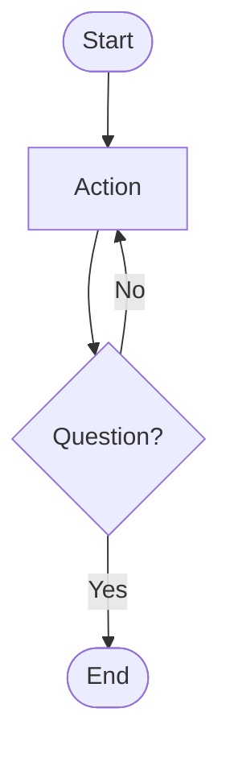
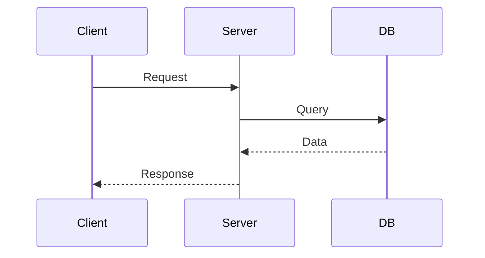
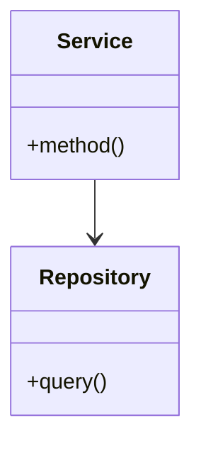
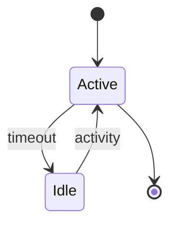

# Mermaid Diagram - Quick Reference

Fast reference for generating diagrams with Claude Code.

---

## Quick Commands

### Automatic (Just Ask)
```
"Show me the architecture of [module]"     → Architecture diagram
"Explain the [process] flow"               → Flowchart
"How does [API endpoint] work?"            → Sequence diagram
"Visualize [entity] states"                → State diagram
```

### Manual (Explicit)
```
/diagram flowchart for [description]       → Flowchart
/diagram sequence for [description]        → Sequence diagram
/diagram architecture of [description]     → Architecture diagram
/diagram state for [description]           → State diagram
/diagram comprehensive for [system]        → All types
```

---

## Trigger Keywords

| Type | Keywords |
|------|----------|
| **Flowchart** | flow, process, algorithm, workflow, steps |
| **Sequence** | api, request, interaction, communication, endpoint |
| **Architecture** | architecture, structure, hierarchy, components, system |
| **State** | state, lifecycle, transitions, session, status |

---

## File Locations

**Generated Diagrams**: `claudedocs/diagrams/`

**Naming**: `{type}_{context}_{YYYY-MM-DD}.md`

**Documentation**:
- `README.md` - Setup & usage
- `EXAMPLES.md` - Workflow examples
- `TEMPLATES.md` - Syntax reference
- `TEST_PLAN.md` - Testing guide

---

## Common Patterns

### Code Structure → Architecture
```
"Show the class hierarchy of auth module"
→ Serena analyzes → Mermaid generates classDiagram
```

### Algorithm → Flowchart
```
"Diagram the login process with error handling"
→ Sequential reasons → Mermaid generates flowchart
```

### API → Sequence
```
"Trace POST /api/login request flow"
→ File analysis → Mermaid generates sequence diagram
```

### States → State Diagram
```
"Show user session lifecycle"
→ State analysis → Mermaid generates state diagram
```

---

## Quick Syntax

### Flowchart


### Sequence


### Architecture


### State


---

## Refinement

**Add Detail**:
```
"Add error handling to the login flowchart"
"Include authentication step in sequence diagram"
```

**Modify**:
```
"Make the diagram more detailed"
"Simplify the architecture diagram"
```

**Compare**:
```
"Show before and after my changes"
```

---

## Rendering

**VS Code**: Install "Markdown Preview Mermaid Support"

**GitHub/GitLab**: Automatic rendering in markdown

**Online**: [mermaid.live](https://mermaid.live/) - Paste code

**Export**: `npm install -g @mermaid-js/mermaid-cli`
```bash
mmdc -i diagram.md -o diagram.png
```

---

## Troubleshooting

| Problem | Solution |
|---------|----------|
| Not generating | Restart Claude Code, verify MCP loaded |
| Wrong type | Use explicit `/diagram [type]` |
| Invalid syntax | Validate at mermaid.live |
| Too complex | Request split: "Break into multiple diagrams" |

---

## Node Shapes Cheat Sheet

```
[Text]      Rectangle
([Text])    Stadium (rounded)
{Text}      Diamond (decision)
[(Text)]    Cylinder (database)
((Text))    Circle
[/Text/]    Parallelogram (input/output)
```

---

## Arrow Cheat Sheet

```
-->         Solid arrow
-.->        Dotted arrow
==>         Thick arrow
<-->        Bidirectional

Sequence:
->>         Solid message
-->>        Dashed return
```

---

## Quick Tips

1. **Start simple** - Add detail iteratively
2. **Be specific** - "login flow" better than "authentication"
3. **Use keywords** - Trigger auto-detection
4. **Ask for refinement** - "Add more detail" or "Simplify"
5. **Check files** - `ls claudedocs/diagrams/`

---

## Common Examples

### User Registration Flow
```
/diagram flowchart for user registration with email verification
```

### API Authentication
```
Show how POST /api/auth/login works
```

### System Architecture
```
Display the complete system architecture
```

### Session Management
```
Visualize user session lifecycle states
```

---

## Integration

**With Serena**:
```
"Analyze auth module structure and create architecture diagram"
```

**With Sequential**:
```
"Reason through password reset logic and create flowchart"
```

**With Context7**:
```
"Show Next.js routing architecture using official patterns"
```

---

## File Structure

```
project/
├── claudedocs/
│   └── diagrams/
│       ├── flowchart_*.md
│       ├── sequence_*.md
│       ├── architecture_*.md
│       └── state_*.md
└── skills/
    └── diagram.md
```

---

## MCP Server Check

**Verify installed**:
```bash
npm list -g mcp-mermaid
```

**Configuration file**:
```
~/Library/Application Support/Claude/claude_desktop_config.json
```

---

## One-Liner Quick Start

After Claude Code restart:
```
"Show me a flowchart for user login"
```

Check result:
```bash
cat claudedocs/diagrams/flowchart_user-login_*.md
```

---

**For full documentation see README.md**
