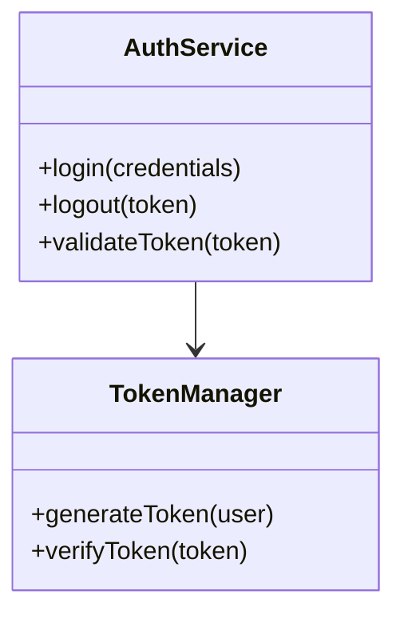
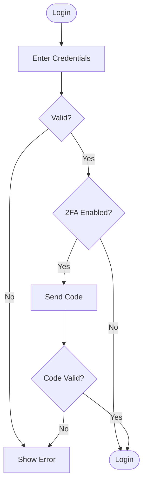
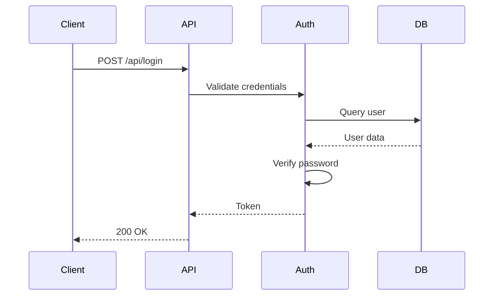

# Mermaid Diagrams Plugin for Claude Code

A Claude Code plugin for generating Mermaid diagrams from code analysis and natural language descriptions with interactive HTML output.

## Features

- **Multiple Diagram Types**: Flowcharts, sequence diagrams, architecture/class diagrams, state diagrams
- **Automatic Type Detection**: Detects diagram type from keywords in your request
- **Code Analysis**: Generate architecture diagrams from actual codebase structure
- **Interactive HTML**: Pan, zoom, and keyboard shortcuts for diagram exploration
- **MCP Integration**: Uses mcp-mermaid server for diagram generation

## Installation

### Prerequisites

- Node.js v16+
- Claude Code CLI

### Install Plugin

```bash
# Clone the plugin
git clone https://github.com/victor/mermaid-diagram-claude-code ~/.claude/plugins/mermaid-diagrams

# Or use with --plugin-dir for testing
claude --plugin-dir /path/to/mermaid-diagram-claude-code
```

The plugin automatically configures the mcp-mermaid MCP server via `.mcp.json`.

## Usage

### Automatic (Skill-Based)

Just ask Claude to create a diagram:

```
"Show me the architecture of the auth module"
"Explain the login flow"
"How does the API authentication work?"
"Visualize the user session states"
```

### Command: /diagram

Use the `/diagram` command for explicit requests:

```
/diagram flowchart for user registration
/diagram sequence for POST /api/login
/diagram architecture of auth module
/diagram state for shopping cart lifecycle
/diagram comprehensive for payment system
```

### Diagram Types

| Type | Keywords | Use For |
|------|----------|---------|
| **Flowchart** | flow, process, algorithm, workflow | Processes, decisions, algorithms |
| **Sequence** | api, request, interaction, endpoint | API calls, component communication |
| **Architecture** | architecture, structure, hierarchy | System structure, class relationships |
| **State** | state, lifecycle, transitions | State machines, lifecycles |

## Output

Diagrams are saved to `claudedocs/diagrams/`:

```
claudedocs/diagrams/
├── flowchart_login_2025-01-12.md      # Markdown (version control)
├── flowchart_login_2025-01-12.html    # Interactive HTML
├── sequence_api-auth_2025-01-12.md
└── sequence_api-auth_2025-01-12.html
```

### Interactive HTML Features

- **Pan & Zoom**: Mouse wheel zoom, click and drag
- **Keyboard Shortcuts**: `+` zoom in, `-` zoom out, `R` reset, `F` fit to screen, `I` info panel
- **Touch Support**: Mobile-friendly

## Plugin Structure

```
mermaid-diagrams/
├── .claude-plugin/
│   └── plugin.json           # Plugin manifest
├── .mcp.json                  # MCP server configuration
├── commands/
│   └── diagram.md            # /diagram command
├── skills/
│   └── mermaid-diagrams/
│       ├── SKILL.md          # Diagram generation skill
│       └── references/
│           ├── templates.md   # Mermaid syntax templates
│           ├── examples.md    # Workflow examples
│           └── html-features.md
├── templates/
│   └── diagram-template.html # HTML template
├── utils/
│   └── generate-html.js      # HTML generator
├── INSTALL.md
└── README.md
```

## Examples

### Architecture from Code

**Request**: "Show me the structure of the auth module"

**Output**:


### Flowchart from Description

**Request**: "/diagram flowchart for user login with 2FA"

**Output**:


### Sequence from API

**Request**: "Diagram the POST /api/login endpoint flow"

**Output**:


## Rendering Diagrams

### View Interactive HTML
```bash
open claudedocs/diagrams/flowchart_login_2025-01-12.html
```

### VS Code
Install "Markdown Preview Mermaid Support" extension

### GitHub/GitLab
Automatically renders mermaid code blocks in markdown

### Online
Paste diagram code at [mermaid.live](https://mermaid.live/)

## Manual HTML Generation

If you only have the markdown file:

```bash
node utils/generate-html.js claudedocs/diagrams/diagram.md
```

## Troubleshooting

### MCP Server Not Loading
1. Verify mcp-mermaid is installed: `npm list -g mcp-mermaid`
2. Check `.mcp.json` configuration
3. Restart Claude Code

### Diagrams Not Auto-Triggering
1. Use specific keywords: "architecture", "flow", "sequence", "state"
2. Be explicit: "Show me the architecture" vs "Explain the code"

### Invalid Mermaid Syntax
1. Validate at [mermaid.live](https://mermaid.live/)
2. Check for missing quotes, brackets, or semicolons

## License

MIT
