# Mermaid Diagram Support for Claude Code

Complete integration of Mermaid diagram generation into Claude Code with automatic triggers, MCP coordination, and cross-session persistence.

## Overview

This integration enables Claude Code to automatically generate flowcharts, sequence diagrams, architecture diagrams, and state diagrams using the Mermaid MCP server. Diagrams are generated from code analysis, natural language descriptions, or manual commands.

## Features

### 🎯 Core Capabilities

| Feature | Description |
|---------|-------------|
| **🤖 Automatic Generation** | Triggered by keywords and context analysis - just ask Claude to visualize |
| **📊 Multiple Diagram Types** | Flowcharts, sequence diagrams, architecture diagrams, and state diagrams |
| **🔄 Interactive Refinement** | Generate → Review → Refine workflow with iterative improvements |
| **💾 Version Control** | Diagrams saved with timestamps for tracking evolution over time |

### 🚀 Advanced Features

| Feature | Description |
|---------|-------------|
| **🎨 Interactive HTML** | Auto-generates zoomable HTML files with pan/zoom controls and keyboard shortcuts |
| **🔗 MCP Coordination** | Seamless integration with Serena (code analysis), Sequential (reasoning), Context7 (documentation) |
| **📝 Markdown Output** | Clean Mermaid code blocks ready for GitHub, GitLab, VS Code, and other renderers |
| **🧠 Cross-Session Memory** | Diagram patterns stored via Serena MCP for intelligent reuse and consistency |

## Installation

**Quick Install:** See [INSTALL.md](INSTALL.md) for complete step-by-step installation guide.

### Quick Start

1. **Install MCP Server**
   ```bash
   npm install -g mcp-mermaid
   ```

2. **Configure Your Tool**

   **For Claude Desktop App:**

   Add to Claude Desktop configuration file:
   - **macOS:** `~/Library/Application Support/Claude/claude_desktop_config.json`
   - **Linux:** `~/.config/Claude/claude_desktop_config.json`
   - **Windows:** `%APPDATA%\Claude\claude_desktop_config.json`

   ```json
   {
     "mcpServers": {
       "mermaid": {
         "command": "npx",
         "args": ["-y", "mcp-mermaid"]
       }
     }
   }
   ```

   **For Claude Code (CLI):**

   Claude Code automatically detects globally installed MCP servers. No additional configuration needed - just install the package globally (step 1) and restart.

3. **Copy Skill File (Optional)**
   ```bash
   cp skills/diagram.md ~/.claude/skills/
   ```

4. **Restart (if using Claude Desktop)**

   Claude Desktop requires restart. Claude Code (CLI) does not.

For detailed installation instructions, troubleshooting, and verification steps, see **[INSTALL.md](INSTALL.md)**.

## Usage

### Automatic Triggering

Claude Code automatically detects when diagrams would be helpful:

```
"Show me the architecture of the auth module"
→ Generates architecture/class diagram

"Explain the login flow"
→ Generates flowchart

"How does the API authentication work?"
→ Generates sequence diagram

"Visualize the user session states"
→ Generates state diagram
```

### Manual Commands

Use the `/diagram` skill for explicit requests:

```
/diagram flowchart for user registration
/diagram sequence for POST /api/login
/diagram architecture of auth module
/diagram state for shopping cart lifecycle
```

### Auto-Detection Examples

**Architecture Diagrams** - Keywords: `architecture`, `structure`, `hierarchy`, `components`
```
"Show the class structure"
"Diagram the system architecture"
"Visualize component relationships"
```

**Flowcharts** - Keywords: `flow`, `process`, `algorithm`, `workflow`
```
"How does the registration process work?"
"Show the password reset flow"
"Diagram the checkout algorithm"
```

**Sequence Diagrams** - Keywords: `api`, `request`, `interaction`, `communication`
```
"Trace the API request flow"
"Show how components communicate"
"Diagram the authentication endpoint"
```

**State Diagrams** - Keywords: `state`, `lifecycle`, `transitions`, `session`
```
"Show the order lifecycle states"
"Diagram session state transitions"
"Visualize the connection states"
```

## Integration with SuperClaude Framework

### MCP Server Coordination

**Serena MCP** → Code structure analysis → Architecture diagrams
```
Serena.get_symbols_overview("src/auth/")
→ Extract classes, methods, relationships
→ Mermaid generates classDiagram
```

**Sequential MCP** → Complex reasoning → Flowcharts
```
Sequential analyzes algorithm logic
→ Identify steps, decisions, branches
→ Mermaid generates flowchart
```

**Context7 MCP** → Framework patterns → Architecture
```
Context7 retrieves Next.js routing patterns
→ Understand framework conventions
→ Mermaid visualizes architecture
```

### MODE Integration

The integration includes a new **Diagram Generation Mode** that activates when:
- Diagram keywords are detected
- Code structure visualization is needed
- Flow documentation is requested
- Architecture understanding is required

See [`MODE_Diagram_Generation.md`](~/.claude/MODE_Diagram_Generation.md) for complete behavioral specifications.

## File Organization

All generated diagrams are saved to:

```
claudedocs/diagrams/
├── architecture_auth-module_2025-12-23.md     # Markdown (version control)
├── architecture_auth-module_2025-12-23.html   # Interactive HTML (zoom support)
├── flowchart_login-process_2025-12-23.md
├── flowchart_login-process_2025-12-23.html
├── sequence_api-request_2025-12-23.md
├── sequence_api-request_2025-12-23.html
├── state_user-session_2025-12-23.md
└── state_user-session_2025-12-23.html
```

**Naming Convention**:
- Markdown: `{type}_{context}_{YYYY-MM-DD}.md`
- HTML: `{type}_{context}_{YYYY-MM-DD}.html`

## Interactive HTML Diagrams

**NEW**: Each diagram is automatically generated as an interactive HTML file with:

### Features
- **Pan & Zoom**: Mouse wheel zoom, click and drag to pan
- **Keyboard Shortcuts**: `+` zoom in, `-` zoom out, `R` reset, `F` fit to screen
- **Info Panel**: Description and related files (`I` to toggle)
- **Professional Design**: Clean interface with responsive layout
- **Touch Support**: Mobile/tablet friendly

### Quick Start

1. **Generate a diagram** (automatically creates both .md and .html):
   ```
   "Show me a flowchart for user login"
   ```

2. **Open the HTML file**:
   ```bash
   open claudedocs/diagrams/flowchart_user-login_2025-12-23.html
   ```

3. **Interact**:
   - Zoom with mouse wheel
   - Pan by dragging
   - Press `F` to fit diagram to screen
   - Press `I` to see description

### Manual HTML Generation

If you only have a markdown file:
```bash
node utils/generate-html.js claudedocs/diagrams/diagram.md
```

See [`HTML_GUIDE.md`](HTML_GUIDE.md) for complete HTML features and usage.

## Output Format

Each diagram file includes:

```markdown
# Diagram Title

**Generated**: 2025-12-23 14:30
**Type**: flowchart | sequence | architecture | state
**Context**: What this diagram represents

## Diagram

\`\`\`mermaid
{mermaid code here}
\`\`\`

## Description
Natural language explanation of the diagram

## Related Files
- Source files analyzed
- Related documentation
```

## Documentation

### Core Files

- **[`MCP_Mermaid.md`](~/.claude/MCP_Mermaid.md)** - Complete MCP server integration guide
- **[`MODE_Diagram_Generation.md`](~/.claude/MODE_Diagram_Generation.md)** - Behavioral mode specifications
- **[`skills/diagram.md`](skills/diagram.md)** - `/diagram` skill documentation
- **[`EXAMPLES.md`](EXAMPLES.md)** - Comprehensive workflow examples
- **[`TEMPLATES.md`](TEMPLATES.md)** - Mermaid syntax templates and quick reference

### SuperClaude Framework Files

All integration files have been added to `~/.claude/`:
- `MCP_Mermaid.md` - MCP server guide
- `MODE_Diagram_Generation.md` - Auto-trigger behaviors

## Examples

### Example 1: Architecture from Code

**Input:**
```
Show me the structure of the auth module
```

**Output:**


**File:** `claudedocs/diagrams/architecture_auth-module_2025-12-23.md`

### Example 2: Flowchart from Description

**Input:**
```
/diagram flowchart for user login with 2FA
```

**Output:**


**File:** `claudedocs/diagrams/flowchart_user-login_2025-12-23.md`

### Example 3: Sequence from API

**Input:**
```
Diagram the POST /api/login endpoint flow
```

**Output:**


**File:** `claudedocs/diagrams/sequence_login-api_2025-12-23.md`

## Templates

See [`TEMPLATES.md`](TEMPLATES.md) for comprehensive Mermaid syntax templates including:

- Flowchart patterns (basic, loops, error handling, decision trees)
- Sequence diagrams (client-server, authentication, microservices, async)
- Architecture diagrams (classes, services, components, modules)
- State diagrams (basic FSM, session lifecycle, order processing)
- Advanced patterns (subgraphs, bidirectional, parallel paths)
- Styling examples

## Rendering Diagrams

Mermaid diagrams can be rendered in:

### VS Code
Install the "Markdown Preview Mermaid Support" extension

### GitHub/GitLab
Automatically renders mermaid code blocks in markdown files

### mermaid-cli (Optional)
Export to PNG/SVG:
```bash
npm install -g @mermaid-js/mermaid-cli
mmdc -i diagram.md -o diagram.png
```

### Online
- [Mermaid Live Editor](https://mermaid.live/)
- Paste diagram code for instant preview

## Best Practices

### 1. Start Simple
- Begin with high-level structure
- Add detail iteratively
- Use subgraphs for organization

### 2. Choose Right Diagram Type
- **Flowcharts**: Algorithms, processes, decisions
- **Sequence**: API calls, component interactions
- **Architecture**: System structure, class hierarchies
- **State**: Lifecycles, state machines, transitions

### 3. Keep Diagrams Focused
- < 20 nodes per diagram for readability
- Split complex systems into multiple diagrams
- Create overview + detailed diagrams for large systems

### 4. Add Context
- Include natural language explanations
- Link to related source files
- Document assumptions and decisions

## Troubleshooting

### MCP Server Not Loading

**Issue**: Mermaid diagrams not generating

**Solution**:
1. Verify installation: `npm list -g mcp-mermaid`
2. Check configuration in `~/Library/Application Support/Claude/claude_desktop_config.json`
3. Restart Claude Code

### Diagrams Not Auto-Triggering

**Issue**: Manual `/diagram` works, but automatic detection doesn't

**Solution**:
1. Use specific keywords: "architecture", "flow", "sequence", "state"
2. Be explicit: "Show me the architecture" vs "Explain the code"
3. Check `MODE_Diagram_Generation.md` for trigger patterns

### Invalid Mermaid Syntax

**Issue**: Diagram won't render

**Solution**:
1. Validate syntax at [Mermaid Live Editor](https://mermaid.live/)
2. Check for missing quotes, brackets, or semicolons
3. Use templates from `TEMPLATES.md` as reference

## Advanced Features

### Comprehensive Documentation

Generate multiple diagram types for complete system documentation:

```
"Provide comprehensive diagrams for the authentication system"

→ Generates:
  - Architecture diagram (structure)
  - Flowchart (login process)
  - Sequence diagram (API flow)
  - State diagram (session lifecycle)
  - Overview document linking all diagrams
```

### Cross-Session Memory

Using Serena MCP integration:
- Diagram patterns stored in project memory
- Evolution tracking across sessions
- Reference previous diagrams in context

### Framework-Specific Diagrams

Leverage Context7 for framework patterns:
```
"Show Next.js routing architecture"
→ Uses Next.js conventions from Context7
→ Generates accurate framework-specific diagram
```

### Emoji Support

All generated diagrams now support emojis using system fonts:

**Supported emoji fonts:**
- Apple Color Emoji (macOS/iOS)
- Segoe UI Emoji (Windows)
- Noto Color Emoji (Linux/Android)

**Usage examples:**

```mermaid
flowchart TD
    Start([🚀 Start Process]) --> Auth{🔐 Authenticated?}
    Auth -->|✅ Yes| Dashboard[📊 Dashboard]
    Auth -->|❌ No| Login[🔑 Login Page]
    Dashboard --> Success([✨ Success])
```


**Recommended emojis for diagrams:**
- Process: 🚀 ⚙️ 🔄 📝
- Security: 🔐 🔑 🛡️ ⚠️
- Success/Error: ✅ ❌ ⚡ 💥
- Data: 📊 📈 📉 💾
- Communication: 📧 💬 📞 🔔
- Users: 👤 👥 🙋 💼

## Testing

See the test file for integration verification:
```bash
# Run test to verify all components
# Tests Serena + Sequential + Mermaid coordination
```

## Contributing

Improvements welcome:
- Additional diagram templates
- Enhanced auto-trigger patterns
- Framework-specific examples
- Integration patterns

## Resources

### Official Documentation
- [Mermaid Documentation](https://mermaid.js.org/)
- [hustcc/mcp-mermaid GitHub](https://github.com/hustcc/mcp-mermaid)

### SuperClaude Framework
- `~/.claude/CLAUDE.md` - Framework entry point
- `~/.claude/MCP_*.md` - MCP server integration guides
- `~/.claude/MODE_*.md` - Behavioral mode specifications

### Related Tools
- Serena MCP: Code structure analysis
- Sequential MCP: Complex reasoning
- Context7 MCP: Framework documentation

## License

This integration follows the SuperClaude framework conventions and is compatible with all existing MCP servers and behavioral modes.

---

**Quick Start**: Just ask Claude Code to show you a flow, architecture, or diagram - it will automatically detect the need and generate appropriate Mermaid visualizations!
