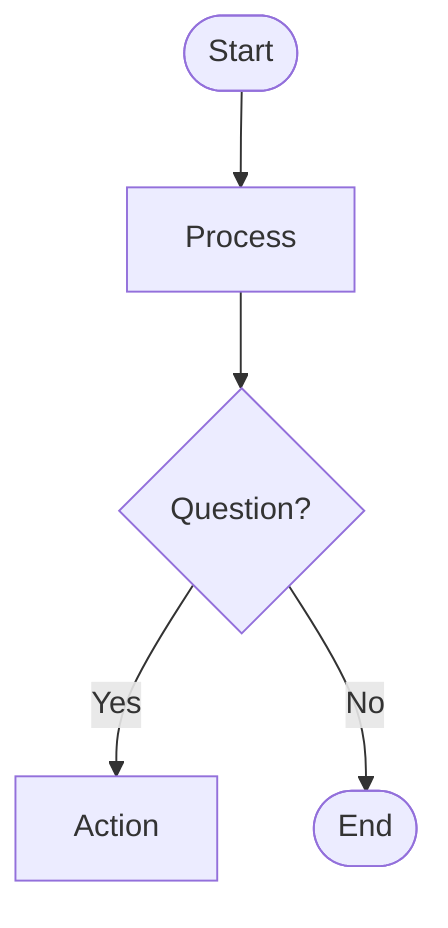
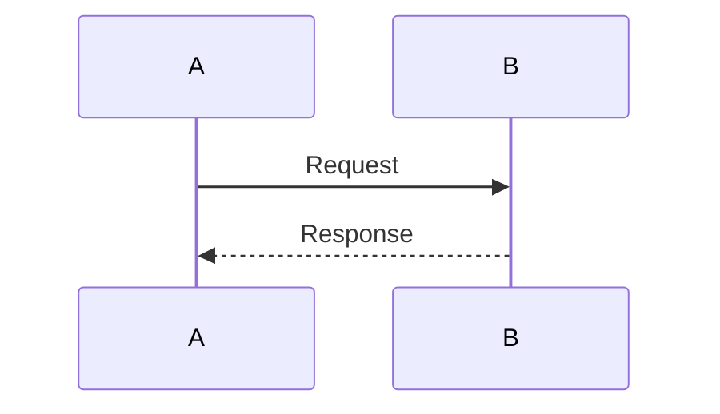
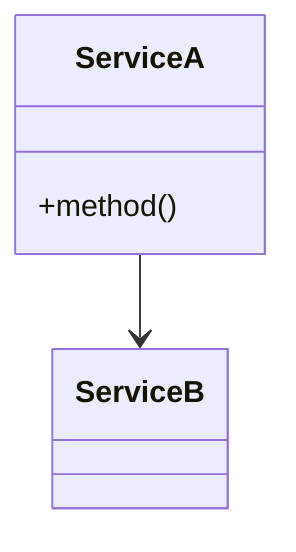
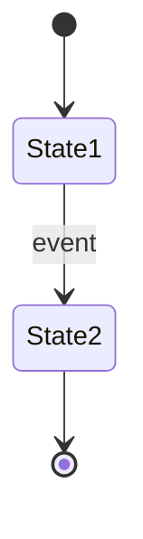

Generate a Mermaid diagram based on the user's request.

## Arguments

Parse the arguments to determine:
- **Type** (optional): flowchart, sequence, architecture, state, comprehensive
- **Description**: What to diagram

If type is not specified, auto-detect based on keywords:
- flowchart: flow, process, algorithm, workflow, steps, decision
- sequence: api, request, interaction, communication, endpoint, call
- architecture: architecture, structure, hierarchy, components, system, class
- state: state, lifecycle, transitions, session, status

## Workflow

### 1. Determine Diagram Type

Based on `$ARGUMENTS`, identify the diagram type. If unclear, ask:
- What should the diagram visualize?
- Is this a process flow, API interaction, system structure, or state machine?

### 2. Gather Information

**For code-based requests** (mentions specific files, modules, or directories):
- Read relevant source files
- Extract classes, functions, relationships
- Identify data flows and dependencies

**For description-based requests**:
- Ask clarifying questions if the scope is unclear
- Identify key components, steps, or states
- Understand relationships and flows

### 3. Generate Diagram

Create Mermaid syntax following these guidelines:

**Flowchart**:


**Sequence**:


**Architecture/Class**:


**State**:


### 4. Create Output Directory

```bash
mkdir -p claudedocs/diagrams
```

### 5. Save Markdown File

Save to `claudedocs/diagrams/{type}_{context}_{date}.md` with format:

```markdown
# {Title}

**Generated**: {YYYY-MM-DD HH:MM}
**Type**: {type}
**Context**: {description}

## Diagram

\`\`\`mermaid
{mermaid code}
\`\`\`

## Description

{Natural language explanation}

## Related Files

- {list source files if applicable}
```

### 6. Generate Interactive HTML

Run:
```bash
node ${CLAUDE_PLUGIN_ROOT}/utils/generate-html.js claudedocs/diagrams/{filename}.md
```

### 7. Report Results

Show:
- Generated diagram (the mermaid code block)
- File paths (both .md and .html)
- How to view: `open claudedocs/diagrams/{filename}.html`
- Offer refinement: "Would you like to add more detail, include error handling, or split into multiple diagrams?"

## Examples

**User**: `/diagram flowchart for user login`
- Type: flowchart
- Generate login process flow with authentication steps

**User**: `/diagram the auth module architecture`
- Type: architecture (auto-detected from "architecture")
- Read auth module files, generate class diagram

**User**: `/diagram sequence for POST /api/users`
- Type: sequence
- Trace API request through layers

**User**: `/diagram user session states`
- Type: state (auto-detected from "states")
- Generate state diagram for session lifecycle

**User**: `/diagram comprehensive for payment system`
- Type: comprehensive
- Generate multiple diagrams: architecture, flow, sequence, state
- Create overview document linking all

## Quality Checklist

Before finalizing:
- [ ] Diagram has less than 20 nodes (split if larger)
- [ ] Labels are clear and descriptive
- [ ] Flows are logical and readable
- [ ] Error/alternative paths included where relevant
- [ ] Both .md and .html files generated
- [ ] Explanation included in markdown
