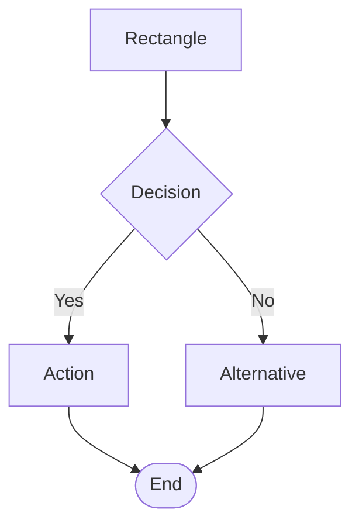
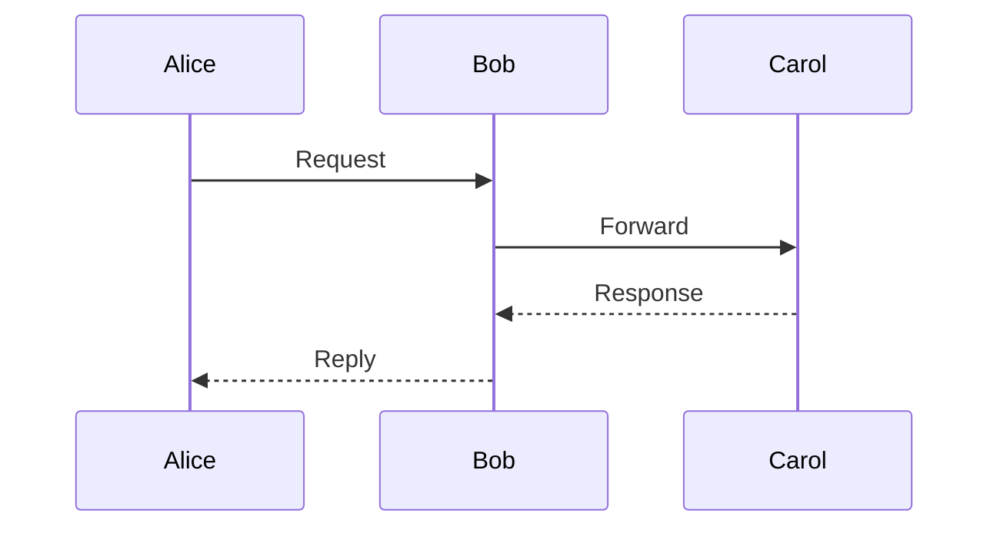
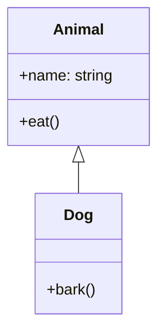
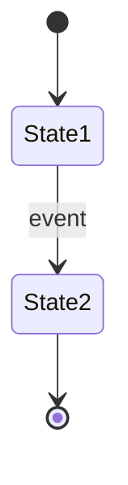

# /diagram - Mermaid Diagram Generation Skill

> **Skill Type**: Interactive diagram generation using Mermaid MCP server
> **Triggers**: `/diagram`, `/mermaid`, `/visualize`

## Description

Generate flowcharts, sequence diagrams, architecture diagrams, and state diagrams using Mermaid syntax. Supports both automatic generation from code analysis and manual creation from natural language descriptions.

## Usage Patterns

```
/diagram [type] [description]
/diagram flowchart for user registration
/diagram sequence for API authentication
/diagram architecture of auth module
/diagram state for user session lifecycle
```

## Parameters

- **type** (optional): flowchart | sequence | architecture | state
- **description**: Natural language description of what to diagram

## Behavior

### Automatic Type Detection
If no type is specified, Claude Code will:
1. Analyze the description/context
2. Determine the most appropriate diagram type
3. Generate accordingly

### Type-Specific Generation

**Flowchart**: Use for processes, algorithms, decision flows
- Keywords: flow, process, steps, workflow, algorithm

**Sequence**: Use for interactions, API calls, message flows
- Keywords: api, request, interaction, communication, call

**Architecture**: Use for system structure, class hierarchies, components
- Keywords: architecture, structure, hierarchy, components, system

**State**: Use for state machines, lifecycles, transitions
- Keywords: state, lifecycle, transitions, session, status

## Integration Behaviors

### With Serena MCP
When analyzing code structure:
```yaml
Process:
  1. Serena: Analyze code symbols and relationships
  2. Extract: Classes, methods, dependencies
  3. Mermaid: Generate appropriate diagram type
  4. Save: claudedocs/diagrams/
```

### With Sequential MCP
When reasoning through complex flows:
```yaml
Process:
  1. Sequential: Reason through logic/flow
  2. Identify: Steps, decisions, branches
  3. Mermaid: Generate flowchart
  4. Save: claudedocs/diagrams/
```

### Standalone
When manually describing:
```yaml
Process:
  1. Parse: User description
  2. Clarify: Ask questions if needed
  3. Mermaid: Generate diagram
  4. Iterate: Refine based on feedback
```

## Output Format

All diagrams are saved to `claudedocs/diagrams/` with format:

```markdown
# {Diagram Title}

**Generated**: {timestamp}
**Type**: {diagram_type}
**Context**: {description}

## Diagram

\`\`\`mermaid
{mermaid code}
\`\`\`

## Description
{explanation}

## Related Files
- {source files if applicable}
```

**Filename**: `{type}_{context}_{YYYY-MM-DD}.md`

## Examples

### Example 1: Flowchart from Description
```
User: /diagram flowchart for user login process

Claude Code:
1. Ask clarifying questions:
   - Include error handling?
   - Two-factor authentication?
   - Remember me functionality?
2. Generate flowchart with decision points
3. Save to claudedocs/diagrams/flowchart_user-login_2025-12-23.md
4. Display diagram in response
5. Offer refinement options
```

### Example 2: Architecture from Code Analysis
```
User: /diagram architecture of the auth module

Claude Code:
1. Serena: get_symbols_overview("src/auth/", depth=2)
2. Analyze: Classes, methods, relationships
3. Generate: Class diagram or component graph
4. Save: claudedocs/diagrams/architecture_auth-module_2025-12-23.md
5. Display with explanation
```

### Example 3: Sequence from API Flow
```
User: /diagram sequence for POST /api/login

Claude Code:
1. Read: API endpoint and related files
2. Trace: Request flow through layers
3. Identify: Participants (Client, API, Auth, DB)
4. Generate: Sequence diagram with message flows
5. Save: claudedocs/diagrams/sequence_login-api_2025-12-23.md
```

### Example 4: State Diagram
```
User: /diagram state for shopping cart

Claude Code:
1. Analyze: Cart states and transitions
2. Identify: States (Empty, Active, CheckedOut, Abandoned)
3. Map: Transitions between states
4. Generate: State diagram
5. Save: claudedocs/diagrams/state_shopping-cart_2025-12-23.md
```

## Refinement Workflow

After generating initial diagram:

```yaml
Offer_Options:
  - "Add more detail to {specific_area}?"
  - "Include error handling flows?"
  - "Show alternative paths?"
  - "Add timing/performance annotations?"
  - "Split into multiple focused diagrams?"

User_Response:
  - Apply requested changes
  - Update saved file
  - Show updated diagram
```

## Best Practices

### 1. Clarity Over Completeness
- Start simple, add complexity iteratively
- Use subgraphs for organization
- Limit nodes per diagram (< 20 for readability)

### 2. Appropriate Diagram Types
- Don't force flowcharts for architecture
- Don't use sequence diagrams for algorithms
- Match diagram type to content

### 3. File Organization
- One diagram per file
- Descriptive filenames
- Include context in markdown
- Link to related source files

### 4. Integration
- Use Serena for code-based diagrams
- Use Sequential for complex logic
- Validate syntax before saving
- Offer refinement options

## Mermaid Syntax Reference

### Flowchart Basics


### Sequence Basics


### Class/Architecture Basics


### State Basics


## Error Handling

```yaml
invalid_syntax:
  detection: "Mermaid validation fails"
  action: "Fix syntax, regenerate"

unclear_description:
  detection: "Ambiguous or incomplete description"
  action: "Ask clarifying questions before generating"

wrong_diagram_type:
  detection: "Diagram type doesn't match content"
  action: "Suggest better type, explain reasoning"

too_complex:
  detection: "Diagram has >20 nodes or deep nesting"
  action: "Suggest splitting into multiple diagrams"
```

## Performance

- **Generation Time**: < 5 seconds for typical diagrams
- **Token Efficiency**: Mermaid syntax is compact
- **Parallel**: Can generate multiple diagram types simultaneously
- **Validation**: Quick syntax check before saving

## Boundaries

**Will:**
- Generate all supported Mermaid diagram types
- Analyze code to extract structure for diagrams
- Ask clarifying questions for manual descriptions
- Save diagrams with proper context and documentation
- Iterate and refine based on feedback

**Will Not:**
- Generate UI mockups (use Magic MCP)
- Create data visualizations/charts (use chart libraries)
- Render diagrams to images (user renders markdown)
- Replace documentation (supplement with visual aids)

## Tool Coordination

```yaml
For Code Analysis:
  Primary: Serena MCP (structure extraction)
  Secondary: Native file reading
  Output: Architecture/Class diagrams

For Flow Logic:
  Primary: Sequential MCP (reasoning)
  Secondary: Native code analysis
  Output: Flowcharts

For API Flows:
  Primary: File reading + analysis
  Secondary: Grep for endpoint patterns
  Output: Sequence diagrams

For State Management:
  Primary: Code analysis
  Secondary: Documentation review
  Output: State diagrams
```

## Cross-Session Memory

Using Serena MCP integration:
- Store generated diagrams in project memory
- Track diagram evolution over time
- Reference diagrams in future sessions
- Maintain diagram library metadata

## Advanced Features

### Multi-Type Generation
```
User: /diagram comprehensive for auth system

Claude Code:
1. Generate architecture diagram (system structure)
2. Generate sequence diagram (login flow)
3. Generate state diagram (session lifecycle)
4. Generate flowchart (password reset process)
5. Save all to claudedocs/diagrams/
6. Create index/overview document
```

### Comparison Diagrams
```
User: /diagram compare current vs proposed architecture

Claude Code:
1. Generate diagram for current architecture
2. Generate diagram for proposed architecture
3. Highlight differences
4. Create side-by-side comparison
```

### Version Evolution
```
User: /diagram evolution of auth system

Claude Code:
1. Read git history or documentation
2. Generate diagrams for each major version
3. Show progression over time
4. Annotate changes between versions
```

## Notes

- Diagrams are version-controlled with date in filename
- Mermaid markdown can be rendered in most modern markdown viewers
- Integration with GitHub/GitLab will show diagrams inline
- VSCode with Mermaid extension provides live preview
- Can be exported to PNG/SVG using mermaid-cli if needed
