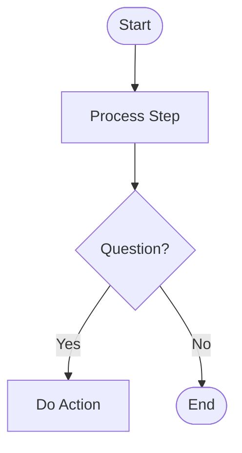
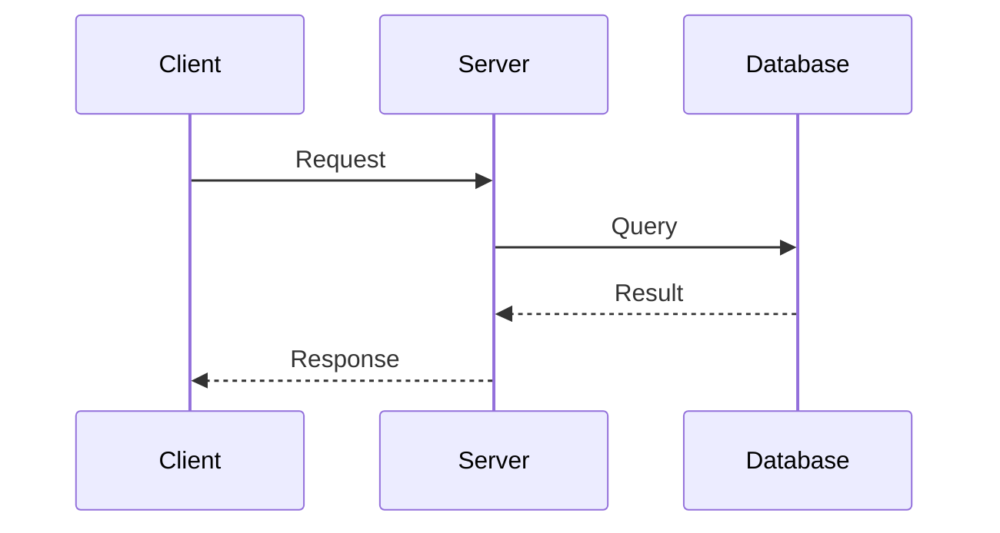
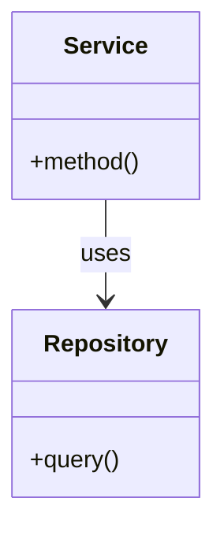
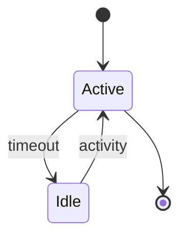

# Mermaid Diagram Generation

## Overview

Generate flowcharts, sequence diagrams, architecture diagrams, and state diagrams using Mermaid syntax. Support both automatic generation from code analysis and manual creation from natural language descriptions.

## Diagram Types

### Flowchart
Use for processes, algorithms, decision flows, and workflows.

**Trigger keywords**: flow, process, steps, workflow, algorithm, decision

**Basic syntax**:


### Sequence Diagram
Use for interactions, API calls, message flows, and component communication.

**Trigger keywords**: api, request, interaction, communication, call, endpoint

**Basic syntax**:


### Architecture/Class Diagram
Use for system structure, class hierarchies, and component relationships.

**Trigger keywords**: architecture, structure, hierarchy, components, system, class

**Basic syntax**:


### State Diagram
Use for state machines, lifecycles, and transitions.

**Trigger keywords**: state, lifecycle, transitions, session, status

**Basic syntax**:


## Generation Workflow

### Step 1: Analyze Request
Determine the appropriate diagram type based on:
- User keywords (see trigger keywords above)
- Context of the request
- Code structure being analyzed

### Step 2: Gather Information
For code-based diagrams:
- Read relevant source files
- Extract classes, functions, relationships
- Identify data flows and dependencies

For description-based diagrams:
- Ask clarifying questions if needed
- Identify key components and relationships
- Understand the flow or structure

### Step 3: Generate Diagram
Create Mermaid code following syntax for the chosen type. Keep diagrams focused:
- Less than 20 nodes for readability
- Use subgraphs for organization
- Add descriptive labels

### Step 4: Save Output
Save diagrams to `claudedocs/diagrams/` with naming convention:
- Markdown: `{type}_{context}_{YYYY-MM-DD}.md`
- HTML: `{type}_{context}_{YYYY-MM-DD}.html`

### Step 5: Generate Interactive HTML
Run the HTML generator script:
```bash
node ${CLAUDE_PLUGIN_ROOT}/utils/generate-html.js claudedocs/diagrams/diagram.md
```

## Output Format

Save diagrams in this markdown format:

```markdown
# {Diagram Title}

**Generated**: {timestamp}
**Type**: {diagram_type}
**Context**: {description}

## Diagram

\`\`\`mermaid
{mermaid code}
\`\`\`

## Description
{explanation of the diagram}

## Related Files
- {source files if applicable}
```

## Node Shapes Reference

| Shape | Syntax | Use For |
|-------|--------|---------|
| Rectangle | `[Text]` | Process steps |
| Stadium | `([Text])` | Start/End |
| Diamond | `{Text}` | Decisions |
| Cylinder | `[(Text)]` | Database |
| Circle | `((Text))` | Connector |
| Parallelogram | `[/Text/]` | Input/Output |

## Arrow Types

| Arrow | Syntax | Use For |
|-------|--------|---------|
| Solid | `-->` | Normal flow |
| Dotted | `-.->` | Optional/async |
| Thick | `==>` | Important path |
| Bidirectional | `<-->` | Two-way |
| With label | `--text-->` | Labeled connection |

## Best Practices

1. **Start simple**: Begin with high-level structure, add detail iteratively
2. **Choose right type**: Match diagram to content (see trigger keywords)
3. **Keep focused**: Less than 20 nodes per diagram
4. **Use subgraphs**: Organize complex diagrams into logical groups
5. **Add context**: Include natural language explanation
6. **Validate syntax**: Test at [mermaid.live](https://mermaid.live/) if needed

## Interactive HTML Features

Generated HTML files include:
- **Pan and Zoom**: Mouse wheel zoom, click and drag to pan
- **Keyboard Shortcuts**: `+` zoom in, `-` zoom out, `R` reset, `F` fit to screen, `I` info panel
- **Info Panel**: Description and related files
- **Touch Support**: Mobile-friendly

## Additional Resources

### Reference Files
For detailed templates and patterns, consult:
- **`references/templates.md`** - Complete Mermaid syntax templates for all diagram types
- **`references/examples.md`** - Workflow examples with code analysis integration
- **`references/html-features.md`** - Interactive HTML generation details

### Utilities
- **`${CLAUDE_PLUGIN_ROOT}/utils/generate-html.js`** - HTML generator script
- **`${CLAUDE_PLUGIN_ROOT}/templates/diagram-template.html`** - HTML template

## Common Patterns

### Code Analysis to Architecture
```
1. Read source files in target directory
2. Extract classes, methods, relationships
3. Generate classDiagram or graph showing structure
4. Document relationships and dependencies
```

### Process to Flowchart
```
1. Identify process steps and decision points
2. Map inputs, outputs, and error paths
3. Generate flowchart with clear labels
4. Add error handling branches
```

### API to Sequence
```
1. Trace request through components
2. Identify participants (client, server, db, etc.)
3. Map request/response flow
4. Include error scenarios with alt blocks
```

### State Machine
```
1. Identify all possible states
2. Map transitions and triggers
3. Include initial and final states
4. Add notes for complex states
```
