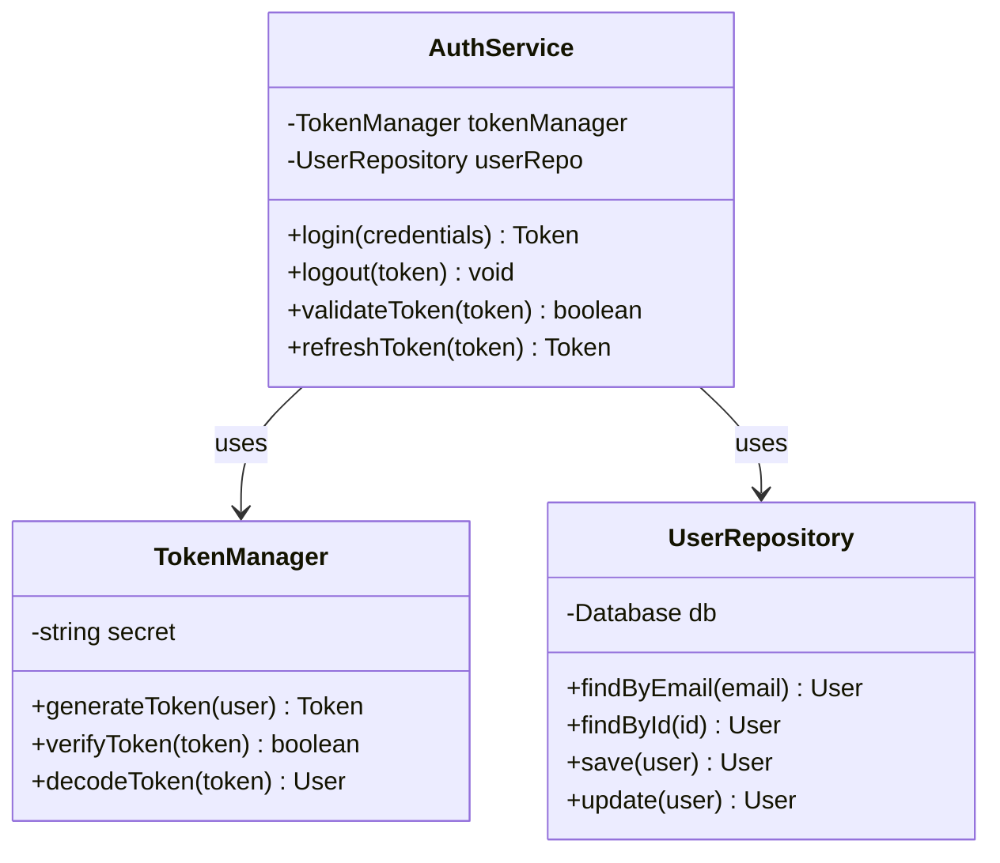
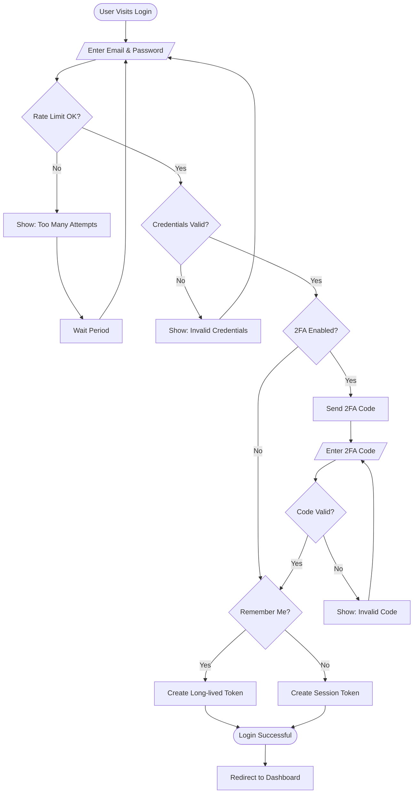
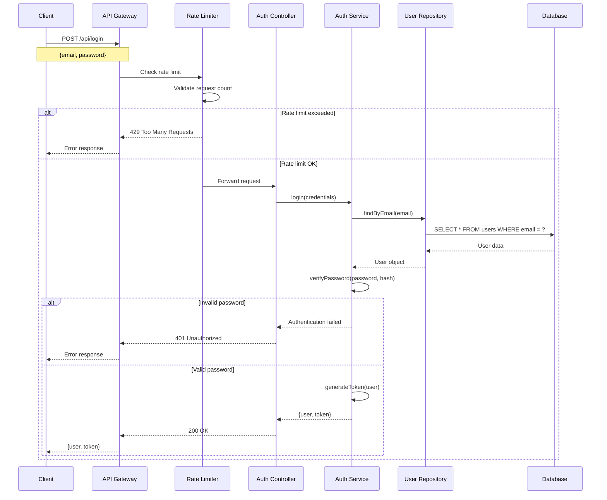
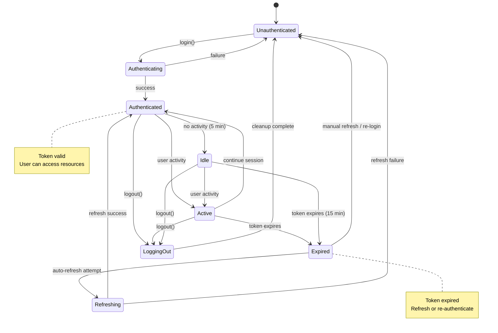
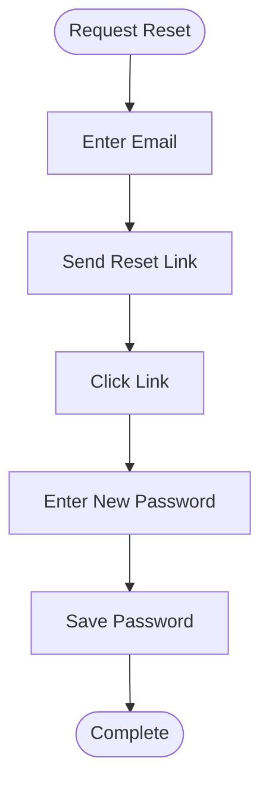
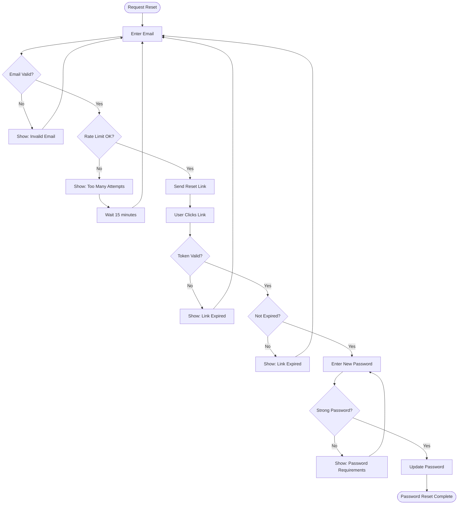
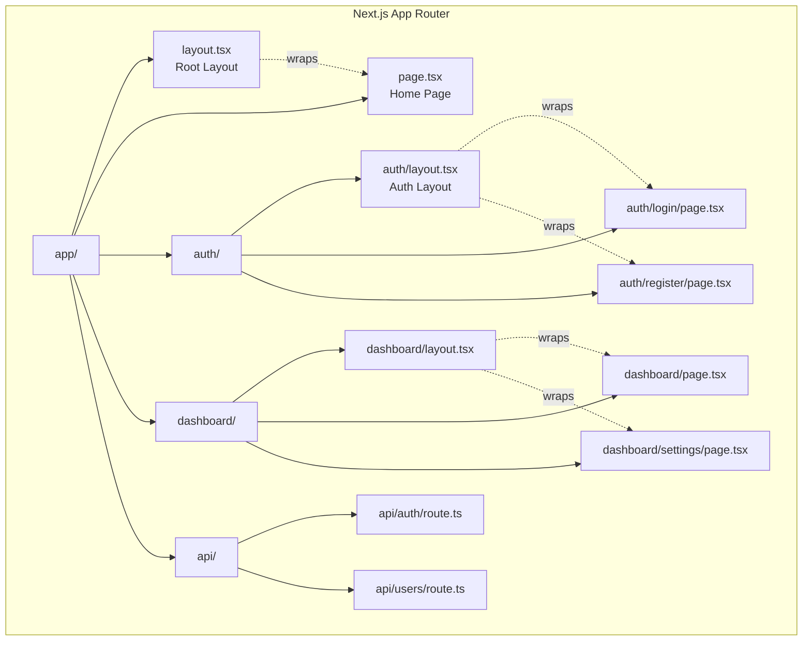

# Mermaid Diagram Generation - Example Workflows

Complete examples demonstrating diagram generation with Serena, Sequential, and Mermaid MCP integration.

---

## Example 1: Architecture Diagram from Code Structure

### Scenario
You want to visualize the structure of an authentication module.

### Workflow

**User Input:**
```
Show me the architecture of the auth module
```

**Claude Code Execution:**

1. **Trigger Detection**
   - Keywords: "architecture", "auth module"
   - Mode: Diagram Generation Mode activated
   - Type: Architecture diagram

2. **Serena Analysis**
   ```yaml
   Tool: serena.get_symbols_overview
   Path: "src/auth/"
   Depth: 2
   Result:
     - AuthService (class)
     - TokenManager (class)
     - UserRepository (class)
     - Methods and relationships extracted
   ```

3. **Mermaid Generation**
   ```yaml
   Tool: mermaid.generate_diagram
   Type: classDiagram
   Input: Extracted structure from Serena
   ```

4. **Output**

**Generated Diagram:**


**File Saved:** `claudedocs/diagrams/architecture_auth-module_2025-12-23.md`

**Natural Language Explanation:**
```
The authentication module consists of three main components:

1. **AuthService**: The main authentication service that orchestrates login,
   logout, and token validation operations. It depends on both TokenManager
   and UserRepository.

2. **TokenManager**: Handles JWT token generation, verification, and decoding.
   Manages the secret key used for token signing.

3. **UserRepository**: Provides data access for user-related operations,
   interfacing with the database layer.

Related files:
- src/auth/AuthService.ts
- src/auth/TokenManager.ts
- src/auth/UserRepository.ts
```

---

## Example 2: Flowchart from Algorithm Analysis

### Scenario
You want to understand the login flow with a visual flowchart.

### Workflow

**User Input:**
```
/diagram flowchart for user login process
```

**Claude Code Execution:**

1. **Manual Command Detection**
   - Command: `/diagram flowchart`
   - Context: "user login process"
   - Mode: Interactive diagram generation

2. **Clarification Questions**
   ```
   Let me clarify the scope:
   1. Include email verification step? (yes/no)
   2. Show 2FA handling? (yes/no)
   3. Add "remember me" functionality? (yes/no)
   4. Include rate limiting checks? (yes/no)
   ```

3. **User Response**
   ```
   1. No
   2. Yes
   3. Yes
   4. Yes
   ```

4. **Mermaid Generation**
   ```yaml
   Tool: mermaid.generate_diagram
   Type: flowchart
   Input: Login process with 2FA, remember me, rate limiting
   ```

**Generated Diagram:**


**File Saved:** `claudedocs/diagrams/flowchart_user-login_2025-12-23.md`

**Refinement Offer:**
```
Would you like me to:
1. Add error handling for network failures?
2. Show session storage details?
3. Add password reset flow branch?
4. Include OAuth login alternative paths?
```

---

## Example 3: Sequence Diagram from API Analysis

### Scenario
You want to trace the API request flow for authentication.

### Workflow

**User Input:**
```
Show how the POST /api/login endpoint works
```

**Claude Code Execution:**

1. **Trigger Detection**
   - Keywords: "endpoint", "POST /api/login"
   - Mode: Diagram Generation Mode
   - Type: Sequence diagram

2. **Code Analysis**
   ```yaml
   Read Files:
     - routes/auth.routes.ts
     - controllers/auth.controller.ts
     - services/auth.service.ts
     - middleware/rate-limit.middleware.ts

   Trace Flow:
     - Client → API Gateway
     - API Gateway → Rate Limit Middleware
     - Rate Limit → Auth Controller
     - Auth Controller → Auth Service
     - Auth Service → User Repository
     - User Repository → Database
   ```

3. **Mermaid Generation**
   ```yaml
   Tool: mermaid.generate_diagram
   Type: sequenceDiagram
   Input: Traced request/response flow
   ```

**Generated Diagram:**


**File Saved:** `claudedocs/diagrams/sequence_login-api_2025-12-23.md`

**Related Files:**
```
- routes/auth.routes.ts:15 (POST /api/login endpoint)
- controllers/auth.controller.ts:45 (login handler)
- services/auth.service.ts:89 (authentication logic)
- middleware/rate-limit.middleware.ts:12 (rate limiting)
```

---

## Example 4: State Diagram from State Management

### Scenario
You want to visualize user session states and transitions.

### Workflow

**User Input:**
```
Diagram the user session lifecycle states
```

**Claude Code Execution:**

1. **Trigger Detection**
   - Keywords: "lifecycle", "states", "session"
   - Mode: Diagram Generation Mode
   - Type: State diagram

2. **Analysis**
   ```yaml
   Analyze:
     - State management code
     - Session handling logic
     - Lifecycle hooks

   Identify States:
     - Unauthenticated
     - Authenticating
     - Authenticated
     - Refreshing
     - Expired
     - Logged Out

   Identify Transitions:
     - login() → Authenticating
     - auth success → Authenticated
     - token expiry → Expired
     - refresh() → Refreshing
     - logout() → Logged Out
   ```

3. **Mermaid Generation**
   ```yaml
   Tool: mermaid.generate_diagram
   Type: stateDiagram-v2
   Input: States and transitions
   ```

**Generated Diagram:**


**File Saved:** `claudedocs/diagrams/state_user-session_2025-12-23.md`

**State Descriptions:**
```
- **Unauthenticated**: Initial state, no valid session
- **Authenticating**: Login in progress
- **Authenticated**: Valid session with fresh token
- **Active**: User actively using the application
- **Idle**: Session valid but no recent activity
- **Expired**: Token expired, refresh needed
- **Refreshing**: Token refresh in progress
- **LoggingOut**: Logout in progress, cleanup happening
```

---

## Example 5: Comprehensive Multi-Diagram Analysis

### Scenario
You want complete visual documentation of the authentication system.

### Workflow

**User Input:**
```
Provide comprehensive diagrams for the authentication system
```

**Claude Code Execution:**

1. **Multi-Type Generation**
   - Generate all relevant diagram types in parallel
   - Coordinate Serena + Sequential + Mermaid

2. **Parallel Execution**
   ```yaml
   Parallel Tasks:
     1. Architecture diagram (Serena → Mermaid)
     2. Login flowchart (Sequential → Mermaid)
     3. API sequence diagram (Analysis → Mermaid)
     4. Session state diagram (Analysis → Mermaid)
   ```

3. **Generated Diagrams**
   - `architecture_auth-system_2025-12-23.md` (class structure)
   - `flowchart_login-process_2025-12-23.md` (login flow)
   - `sequence_auth-api_2025-12-23.md` (API interactions)
   - `state_session-lifecycle_2025-12-23.md` (session states)

4. **Overview Document**

**File Saved:** `claudedocs/diagrams/OVERVIEW_auth-system_2025-12-23.md`

```markdown
# Authentication System - Complete Visual Documentation

Generated: 2025-12-23

## System Overview

This documentation provides comprehensive visual representation of the
authentication system across multiple perspectives.

## Diagrams

### 1. Architecture (Structure)
**File**: [architecture_auth-system_2025-12-23.md](./architecture_auth-system_2025-12-23.md)

Shows the class structure and component relationships.

**Key Insights:**
- Three main components: AuthService, TokenManager, UserRepository
- Clear separation of concerns
- Single-direction dependencies

### 2. Login Process (Flow)
**File**: [flowchart_login-process_2025-12-23.md](./flowchart_login-process_2025-12-23.md)

Illustrates the complete login workflow including 2FA and rate limiting.

**Key Insights:**
- Multiple security checks (rate limit, credentials, 2FA)
- Clear error handling paths
- Optional "remember me" functionality

### 3. API Communication (Sequence)
**File**: [sequence_auth-api_2025-12-23.md](./sequence_auth-api_2025-12-23.md)

Traces the request/response flow through all system layers.

**Key Insights:**
- 7-layer interaction pattern
- Rate limiting at gateway level
- Database interaction isolated in repository

### 4. Session Lifecycle (State)
**File**: [state_session-lifecycle_2025-12-23.md](./state_session-lifecycle_2025-12-23.md)

Visualizes all possible session states and transitions.

**Key Insights:**
- 8 distinct states
- Auto-refresh mechanism for expired tokens
- Idle timeout after 5 minutes of inactivity

## Usage

These diagrams can be:
- Rendered in markdown viewers (GitHub, GitLab, VS Code)
- Exported to PNG/SVG using mermaid-cli
- Embedded in documentation
- Used for onboarding new developers
- Referenced in design reviews

## Maintenance

Update diagrams when:
- Architecture changes (new components, relationships)
- Flow logic is modified (new steps, decision points)
- API contracts change (new endpoints, parameters)
- State management evolves (new states, transitions)
```

---

## Example 6: Interactive Refinement

### Scenario
Initial diagram needs refinement based on feedback.

### Workflow

**Initial User Input:**
```
/diagram flowchart for password reset
```

**Initial Generation:**


**User Feedback:**
```
Add email validation, token expiration, and rate limiting
```

**Refined Generation:**


**File Updated:** `claudedocs/diagrams/flowchart_password-reset_2025-12-23.md`

---

## Example 7: Framework-Specific Architecture

### Scenario
Visualize Next.js routing architecture using Context7 patterns.

### Workflow

**User Input:**
```
Show the Next.js routing architecture for this app
```

**Claude Code Execution:**

1. **MCP Coordination**
   ```yaml
   Context7:
     - Fetch Next.js routing patterns
     - Get App Router conventions

   Serena:
     - Analyze app/ directory structure
     - Extract route definitions

   Mermaid:
     - Generate architecture diagram
   ```

**Generated Diagram:**


**File Saved:** `claudedocs/diagrams/architecture_nextjs-routing_2025-12-23.md`

---

## Summary

These examples demonstrate:

1. **Automatic Generation**: Triggered by keywords and context
2. **Manual Commands**: Using `/diagram` for explicit requests
3. **Multi-MCP Coordination**: Serena + Sequential + Context7 + Mermaid
4. **Iterative Refinement**: Generate → Feedback → Improve
5. **Comprehensive Documentation**: Multiple diagram types for complete understanding
6. **Framework Integration**: Leveraging Context7 for framework-specific patterns

All diagrams are:
- Saved to `claudedocs/diagrams/`
- Version-controlled with dates
- Accompanied by natural language explanations
- Ready for rendering in markdown viewers
