# Mermaid Diagram Templates

Quick reference templates for all supported Mermaid diagram types.

---

## Flowchart Templates

### Basic Process Flow
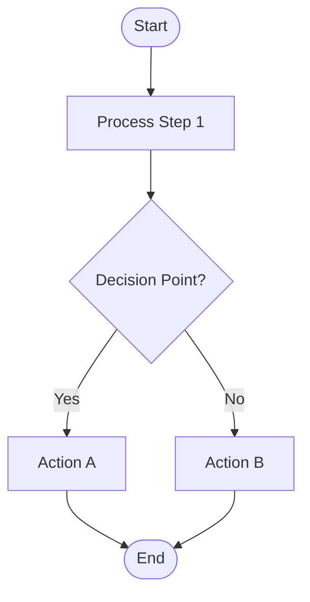
```mermaid
flowchart TD
    Start([Start]) --> Step1[Process Step 1]
    Step1 --> Decision{Decision Point?}
    Decision -->|Yes| Step2A[Action A]
    Decision -->|No| Step2B[Action B]
    Step2A --> End([End])
    Step2B --> End
```

### Algorithm with Loops
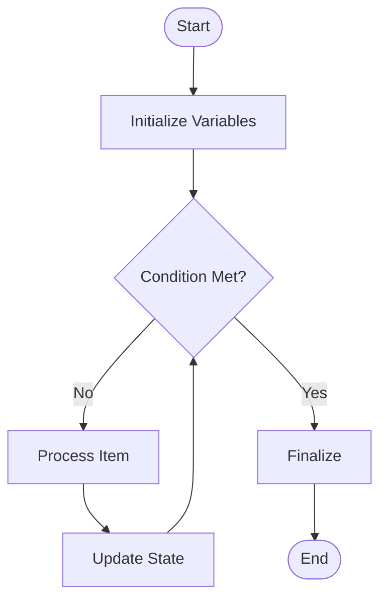
```mermaid
flowchart TD
    Start([Start]) --> Init[Initialize Variables]
    Init --> Loop{Condition Met?}
    Loop -->|No| Process[Process Item]
    Process --> Update[Update State]
    Update --> Loop
    Loop -->|Yes| Finish[Finalize]
    Finish --> End([End])
```

### Error Handling Flow
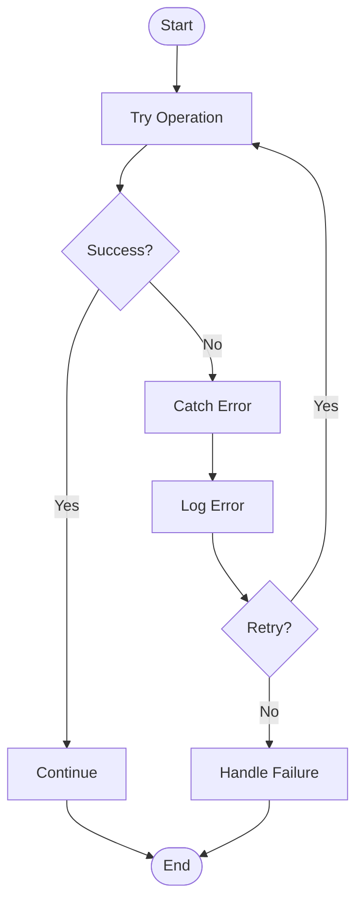
```mermaid
flowchart TD
    Start([Start]) --> Try[Try Operation]
    Try --> Success{Success?}
    Success -->|Yes| Continue[Continue]
    Success -->|No| Catch[Catch Error]
    Catch --> Log[Log Error]
    Log --> Retry{Retry?}
    Retry -->|Yes| Try
    Retry -->|No| Fail[Handle Failure]
    Continue --> End([End])
    Fail --> End
```

### Multi-Path Decision Tree
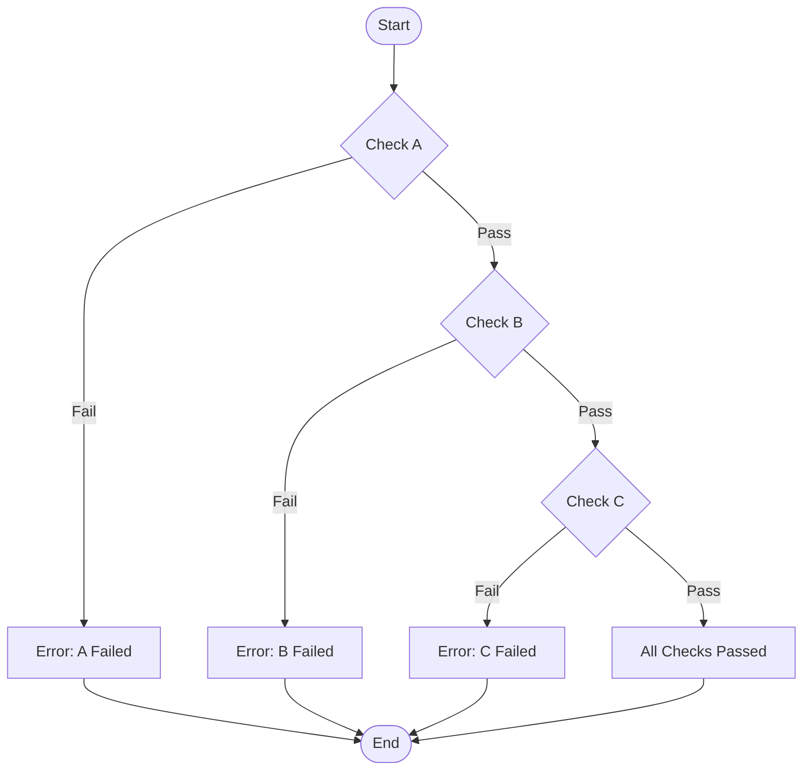
```mermaid
flowchart TD
    Start([Start]) --> Check1{Check A}
    Check1 -->|Pass| Check2{Check B}
    Check1 -->|Fail| ErrorA[Error: A Failed]

    Check2 -->|Pass| Check3{Check C}
    Check2 -->|Fail| ErrorB[Error: B Failed]

    Check3 -->|Pass| Success[All Checks Passed]
    Check3 -->|Fail| ErrorC[Error: C Failed]

    ErrorA --> End([End])
    ErrorB --> End
    ErrorC --> End
    Success --> End
```

---

## Sequence Diagram Templates

### Basic Client-Server
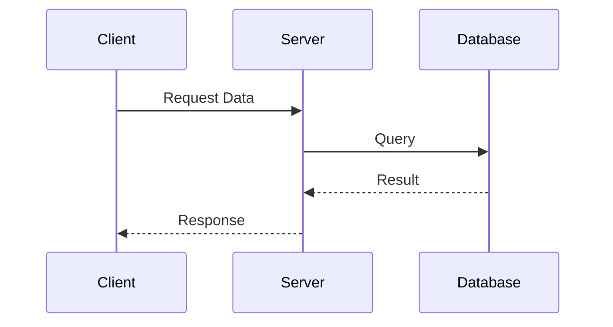
```mermaid
sequenceDiagram
    participant Client
    participant Server
    participant Database

    Client->>Server: Request Data
    Server->>Database: Query
    Database-->>Server: Result
    Server-->>Client: Response
```

### API with Authentication
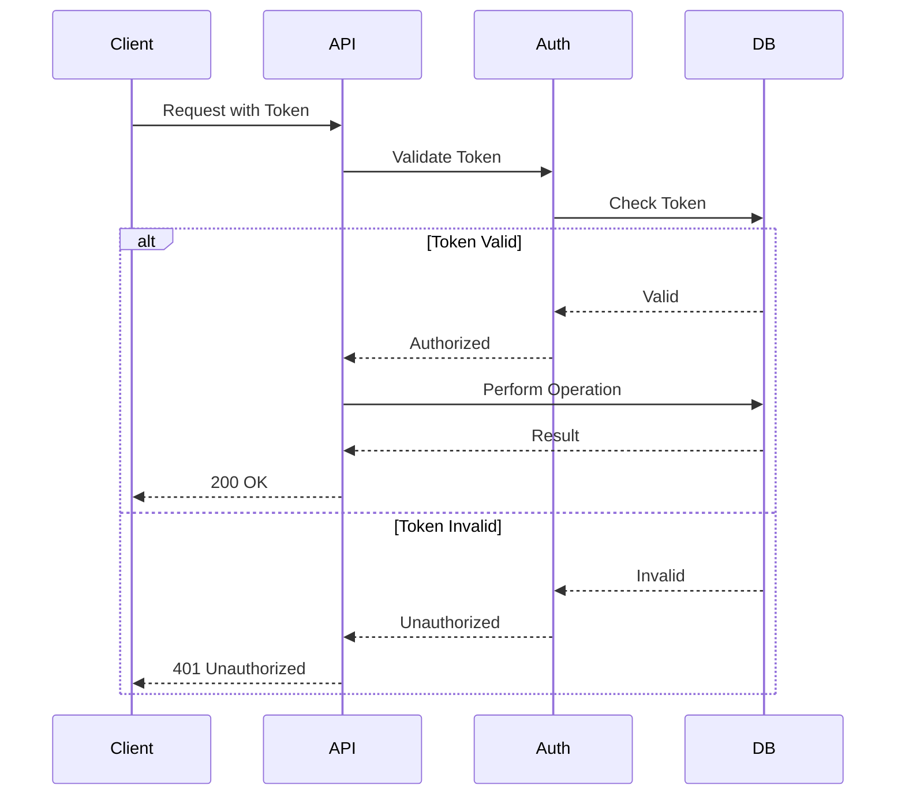
```mermaid
sequenceDiagram
    participant Client
    participant API
    participant Auth
    participant DB

    Client->>API: Request with Token
    API->>Auth: Validate Token
    Auth->>DB: Check Token

    alt Token Valid
        DB-->>Auth: Valid
        Auth-->>API: Authorized
        API->>DB: Perform Operation
        DB-->>API: Result
        API-->>Client: 200 OK
    else Token Invalid
        DB-->>Auth: Invalid
        Auth-->>API: Unauthorized
        API-->>Client: 401 Unauthorized
    end
```

### Microservices Communication
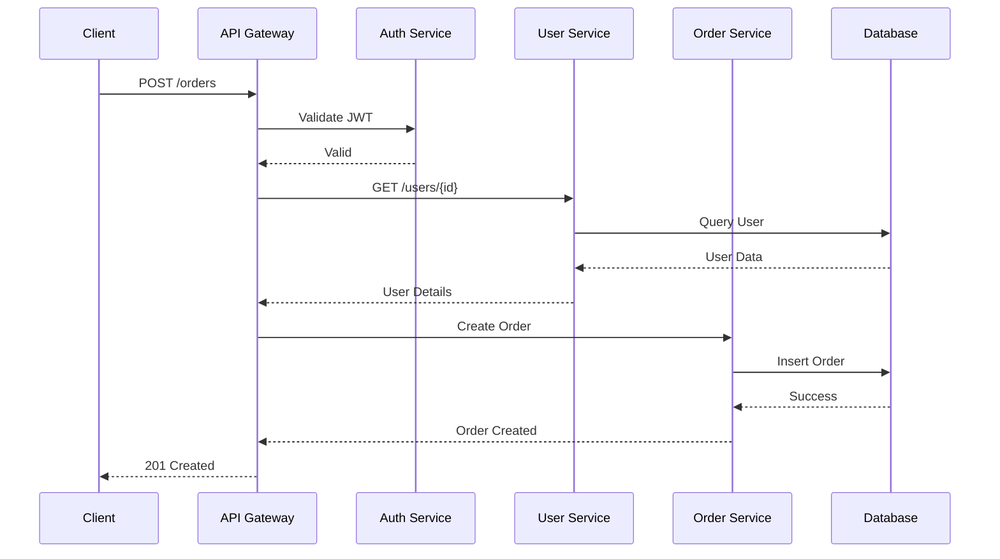
```mermaid
sequenceDiagram
    participant Client
    participant Gateway as API Gateway
    participant Auth as Auth Service
    participant User as User Service
    participant Order as Order Service
    participant DB as Database

    Client->>Gateway: POST /orders
    Gateway->>Auth: Validate JWT
    Auth-->>Gateway: Valid

    Gateway->>User: GET /users/{id}
    User->>DB: Query User
    DB-->>User: User Data
    User-->>Gateway: User Details

    Gateway->>Order: Create Order
    Order->>DB: Insert Order
    DB-->>Order: Success
    Order-->>Gateway: Order Created

    Gateway-->>Client: 201 Created
```

### Async Message Queue
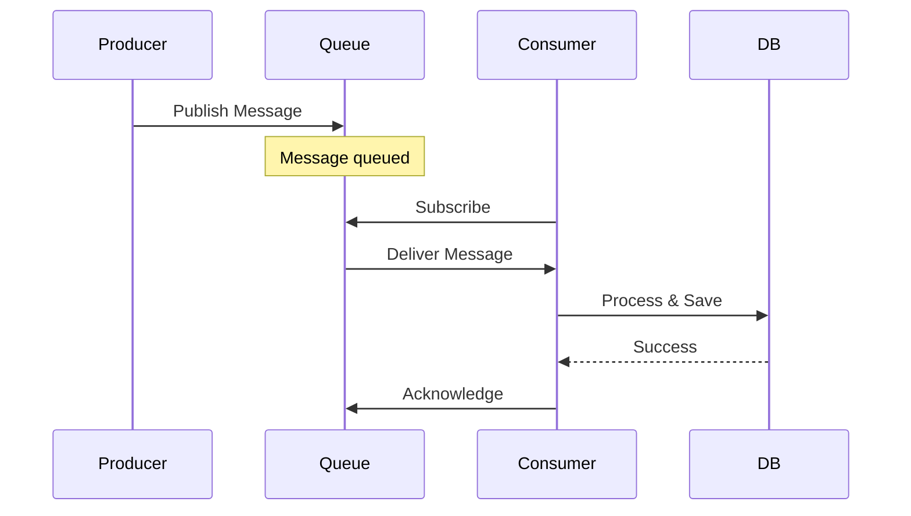
```mermaid
sequenceDiagram
    participant Producer
    participant Queue
    participant Consumer
    participant DB

    Producer->>Queue: Publish Message
    Note over Queue: Message queued

    Consumer->>Queue: Subscribe
    Queue->>Consumer: Deliver Message
    Consumer->>DB: Process & Save
    DB-->>Consumer: Success
    Consumer->>Queue: Acknowledge
```

---

## Architecture/Class Diagram Templates

### Basic Class Structure
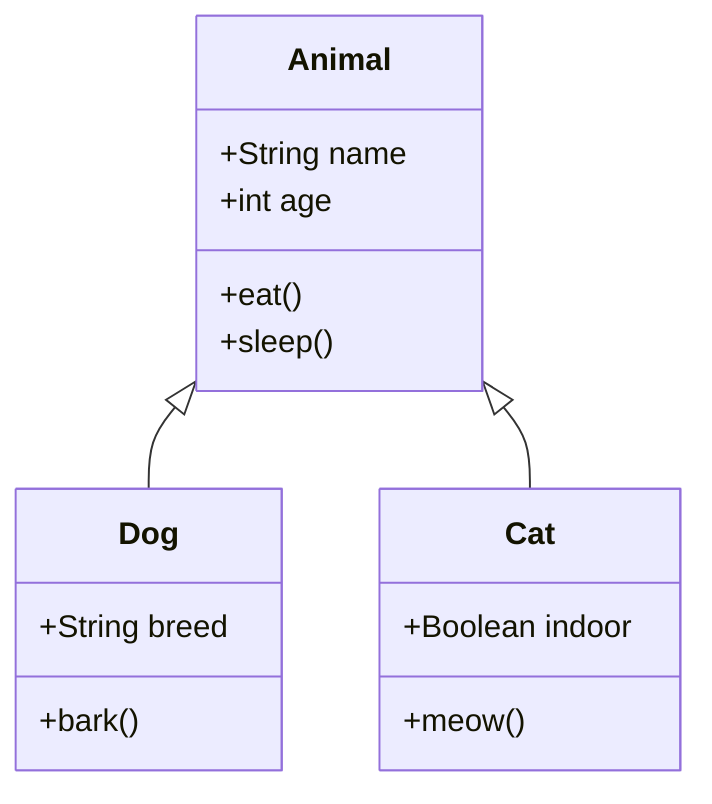
```mermaid
classDiagram
    class Animal {
        +String name
        +int age
        +eat()
        +sleep()
    }

    class Dog {
        +String breed
        +bark()
    }

    class Cat {
        +Boolean indoor
        +meow()
    }

    Animal <|-- Dog
    Animal <|-- Cat
```

### Service Architecture
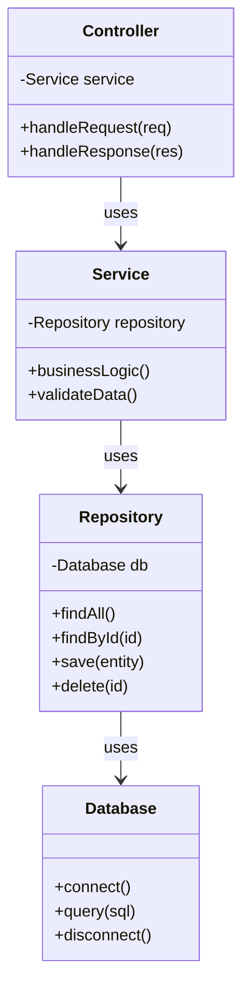
```mermaid
classDiagram
    class Controller {
        -Service service
        +handleRequest(req)
        +handleResponse(res)
    }

    class Service {
        -Repository repository
        +businessLogic()
        +validateData()
    }

    class Repository {
        -Database db
        +findAll()
        +findById(id)
        +save(entity)
        +delete(id)
    }

    class Database {
        +connect()
        +query(sql)
        +disconnect()
    }

    Controller --> Service : uses
    Service --> Repository : uses
    Repository --> Database : uses
```

### Component Architecture
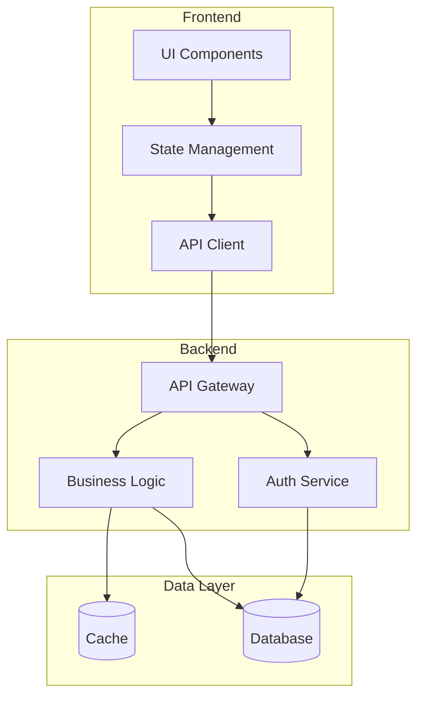
```mermaid
graph TB
    subgraph "Frontend"
        UI[UI Components]
        State[State Management]
        API[API Client]
    end

    subgraph "Backend"
        Gateway[API Gateway]
        Auth[Auth Service]
        Business[Business Logic]
    end

    subgraph "Data Layer"
        Cache[(Cache)]
        DB[(Database)]
    end

    UI --> State
    State --> API
    API --> Gateway
    Gateway --> Auth
    Gateway --> Business
    Business --> Cache
    Business --> DB
    Auth --> DB
```

### Module Dependencies
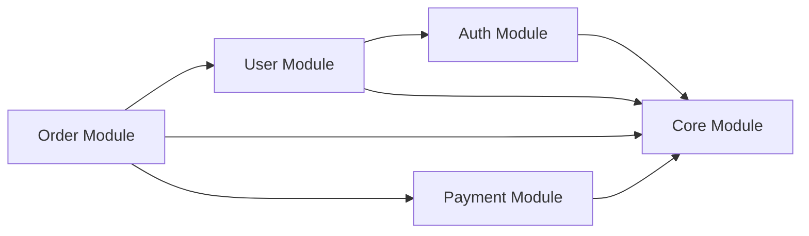
```mermaid
graph LR
    Core[Core Module]
    Auth[Auth Module]
    User[User Module]
    Order[Order Module]
    Payment[Payment Module]

    Auth --> Core
    User --> Core
    User --> Auth
    Order --> Core
    Order --> User
    Order --> Payment
    Payment --> Core
```

---

## State Diagram Templates

### Basic State Machine
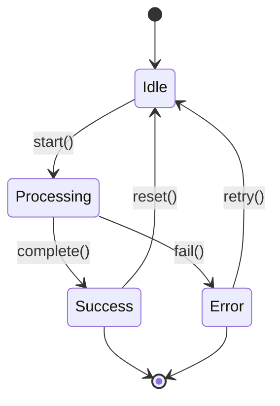
```mermaid
stateDiagram-v2
    [*] --> Idle
    Idle --> Processing: start()
    Processing --> Success: complete()
    Processing --> Error: fail()
    Success --> Idle: reset()
    Error --> Idle: retry()
    Success --> [*]
    Error --> [*]
```

### User Session Lifecycle
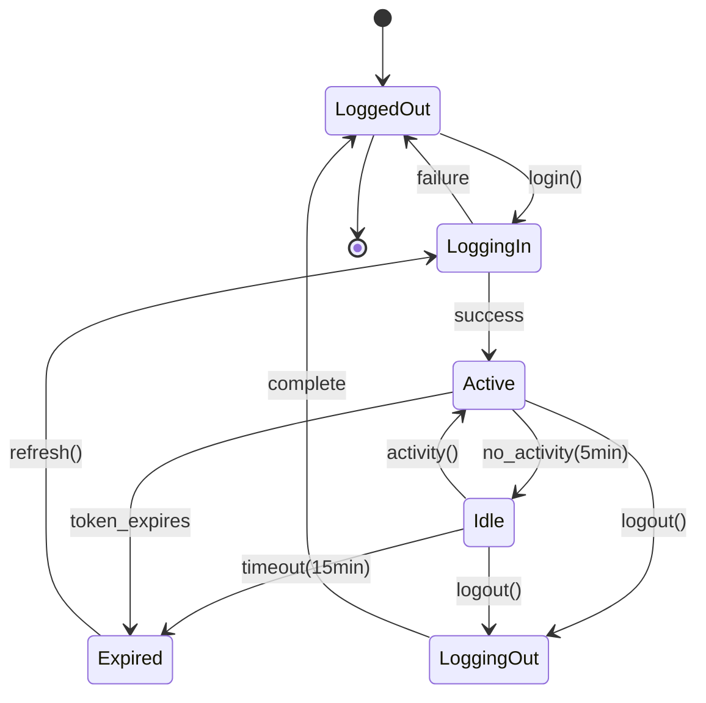
```mermaid
stateDiagram-v2
    [*] --> LoggedOut

    LoggedOut --> LoggingIn: login()
    LoggingIn --> Active: success
    LoggingIn --> LoggedOut: failure

    Active --> Idle: no_activity(5min)
    Idle --> Active: activity()
    Idle --> Expired: timeout(15min)

    Active --> Expired: token_expires
    Expired --> LoggingIn: refresh()

    Active --> LoggingOut: logout()
    Idle --> LoggingOut: logout()
    LoggingOut --> LoggedOut: complete

    LoggedOut --> [*]
```

### Order Processing States
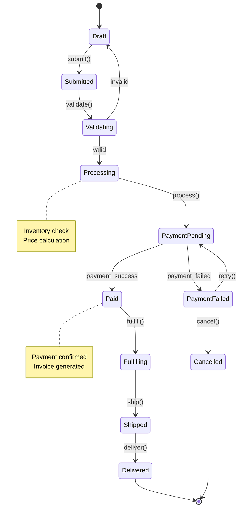
```mermaid
stateDiagram-v2
    [*] --> Draft

    Draft --> Submitted: submit()
    Submitted --> Validating: validate()

    Validating --> Processing: valid
    Validating --> Draft: invalid

    Processing --> PaymentPending: process()
    PaymentPending --> Paid: payment_success
    PaymentPending --> PaymentFailed: payment_failed

    PaymentFailed --> Cancelled: cancel()
    PaymentFailed --> PaymentPending: retry()

    Paid --> Fulfilling: fulfill()
    Fulfilling --> Shipped: ship()
    Shipped --> Delivered: deliver()

    Delivered --> [*]
    Cancelled --> [*]

    note right of Processing
        Inventory check
        Price calculation
    end note

    note right of Paid
        Payment confirmed
        Invoice generated
    end note
```

### Connection State Machine
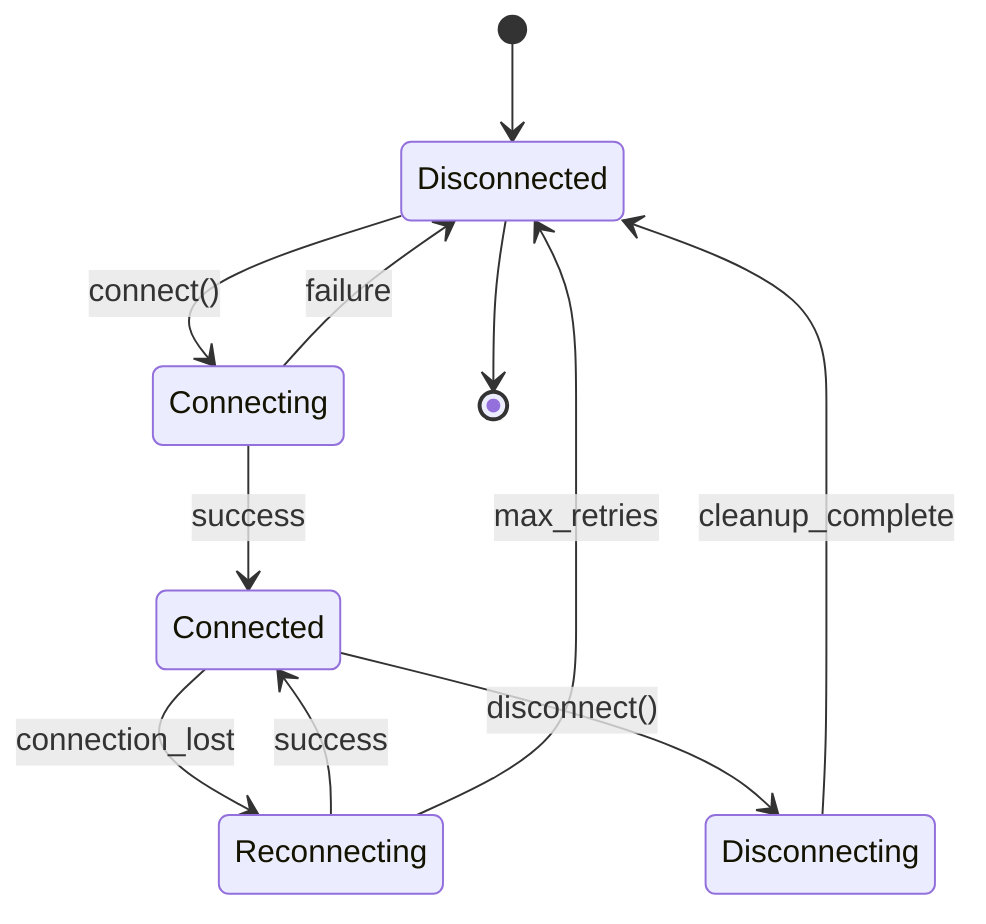
```mermaid
stateDiagram-v2
    [*] --> Disconnected

    Disconnected --> Connecting: connect()
    Connecting --> Connected: success
    Connecting --> Disconnected: failure

    Connected --> Reconnecting: connection_lost
    Reconnecting --> Connected: success
    Reconnecting --> Disconnected: max_retries

    Connected --> Disconnecting: disconnect()
    Disconnecting --> Disconnected: cleanup_complete

    Disconnected --> [*]
```

---

## Advanced Templates

### Subgraph Organization
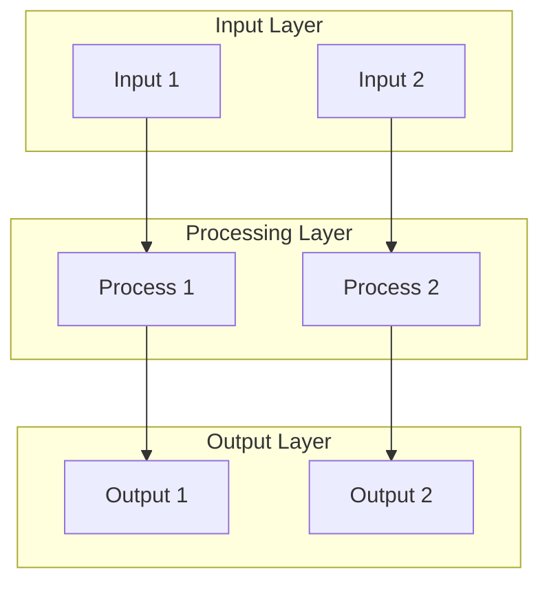
```mermaid
flowchart TB
    subgraph "Input Layer"
        I1[Input 1]
        I2[Input 2]
    end

    subgraph "Processing Layer"
        P1[Process 1]
        P2[Process 2]
    end

    subgraph "Output Layer"
        O1[Output 1]
        O2[Output 2]
    end

    I1 --> P1
    I2 --> P2
    P1 --> O1
    P2 --> O2
```

### Bidirectional Flow
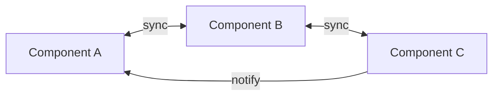
```mermaid
flowchart LR
    A[Component A] <-->|sync| B[Component B]
    B <-->|sync| C[Component C]
    C -->|notify| A
```

### Parallel Paths
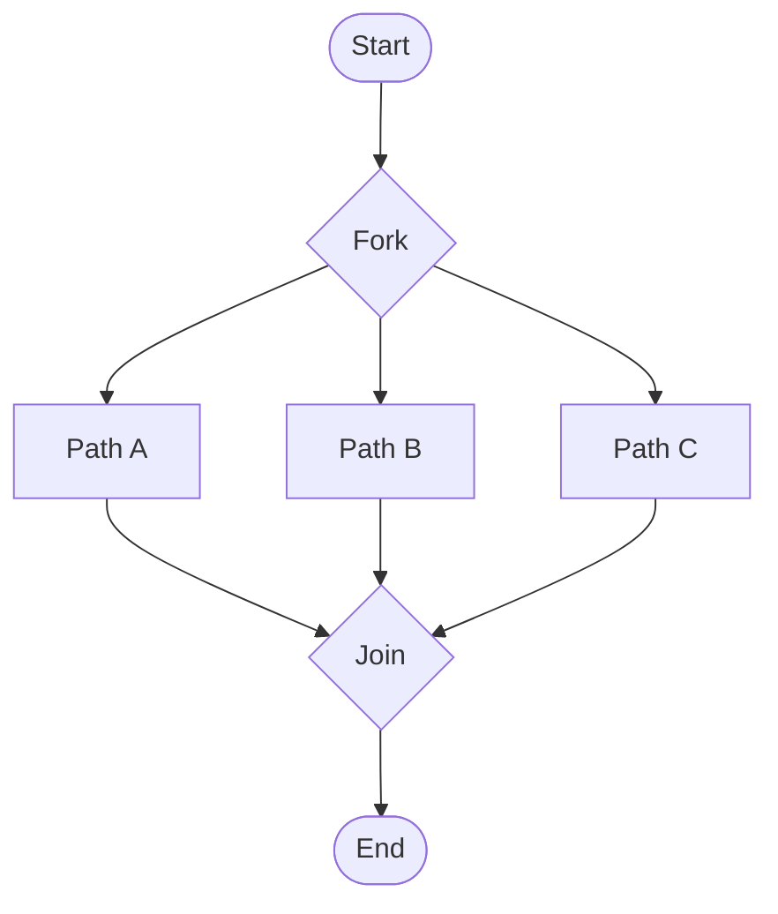
```mermaid
flowchart TD
    Start([Start]) --> Fork{Fork}
    Fork --> Path1[Path A]
    Fork --> Path2[Path B]
    Fork --> Path3[Path C]

    Path1 --> Join{Join}
    Path2 --> Join
    Path3 --> Join

    Join --> End([End])
```

### Nested Conditions
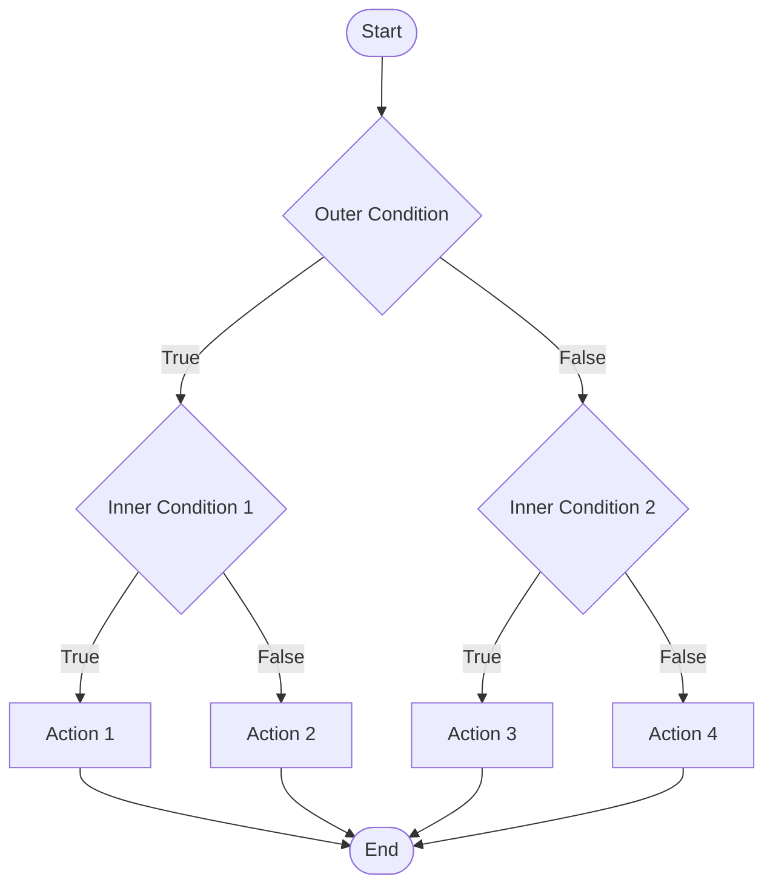
```mermaid
flowchart TD
    Start([Start]) --> Outer{Outer Condition}
    Outer -->|True| Inner1{Inner Condition 1}
    Outer -->|False| Inner2{Inner Condition 2}

    Inner1 -->|True| Action1[Action 1]
    Inner1 -->|False| Action2[Action 2]

    Inner2 -->|True| Action3[Action 3]
    Inner2 -->|False| Action4[Action 4]

    Action1 --> End([End])
    Action2 --> End
    Action3 --> End
    Action4 --> End
```

---

## Styling Examples

### Colored Nodes
```mermaid
flowchart TD
    Start([Start]):::startClass
    Process[Process]:::processClass
    Decision{Decision?}:::decisionClass
    Success[Success]:::successClass
    Error[Error]:::errorClass

    Start --> Process
    Process --> Decision
    Decision -->|Yes| Success
    Decision -->|No| Error

    classDef startClass fill:#90EE90
    classDef processClass fill:#87CEEB
    classDef decisionClass fill:#FFD700
    classDef successClass fill:#98FB98
    classDef errorClass fill:#FFB6C1
```

### Highlighted Paths
```mermaid
flowchart LR
    A[Start] --> B[Step 1]
    B --> C[Step 2]
    C --> D[Step 3]
    D --> E[End]

    linkStyle 0,1,2,3 stroke:#ff3,stroke-width:4px
```

---

## Common Patterns

### CRUD Operations
```mermaid
flowchart TD
    Start([API Request]) --> Route{Route}
    Route -->|POST| Create[Create]
    Route -->|GET| Read[Read]
    Route -->|PUT| Update[Update]
    Route -->|DELETE| Delete[Delete]

    Create --> Validate1[Validate]
    Read --> Auth1[Authorize]
    Update --> Validate2[Validate]
    Delete --> Auth2[Authorize]

    Validate1 --> DB1[(Database)]
    Auth1 --> DB2[(Database)]
    Validate2 --> DB3[(Database)]
    Auth2 --> DB4[(Database)]

    DB1 --> Response1[201 Created]
    DB2 --> Response2[200 OK]
    DB3 --> Response3[200 OK]
    DB4 --> Response4[204 No Content]
```

### Authentication Flow
```mermaid
sequenceDiagram
    participant U as User
    participant C as Client
    participant A as Auth Server
    participant R as Resource Server

    U->>C: Login Credentials
    C->>A: POST /auth/login
    A->>A: Validate Credentials
    A->>A: Generate Token
    A-->>C: Access Token + Refresh Token

    C->>R: Request + Access Token
    R->>A: Validate Token
    A-->>R: Token Valid
    R-->>C: Protected Resource

    Note over C,A: Token Expires

    C->>A: POST /auth/refresh
    A->>A: Validate Refresh Token
    A-->>C: New Access Token
```

### Error Recovery Pattern
```mermaid
flowchart TD
    Start([Start]) --> Try[Try Operation]
    Try --> Check{Success?}
    Check -->|Yes| Success[Operation Successful]
    Check -->|No| Count{Retry Count < Max?}

    Count -->|Yes| Wait[Wait with Backoff]
    Wait --> Try

    Count -->|No| Log[Log Error]
    Log --> Fallback[Execute Fallback]
    Fallback --> Notify[Notify Admin]

    Success --> End([End])
    Notify --> End
```

---

## Quick Reference

### Node Shapes
- `[Text]` - Rectangle
- `([Text])` - Stadium (rounded)
- `[[Text]]` - Subroutine
- `[(Text)]` - Cylinder (database)
- `((Text))` - Circle
- `{Text}` - Diamond (decision)
- `{{Text}}` - Hexagon
- `[/Text/]` - Parallelogram (input/output)

### Arrow Types
- `-->` - Solid arrow
- `-.->` - Dotted arrow
- `==>` - Thick arrow
- `--text-->` - Arrow with text
- `<-->` - Bidirectional

### Sequence Diagram
- `->>` - Solid arrow
- `-->>` - Dashed arrow (return)
- `-x` - Cross (end)
- `-)` - Open arrow

### Subgraphs
```mermaid
graph TB
    subgraph "Group Name"
        A --> B
    end
```

---

## Usage Tips

1. **Keep It Simple**: Start with basic structure, add complexity iteratively
2. **Use Subgraphs**: Organize complex diagrams into logical groups
3. **Consistent Naming**: Use clear, descriptive labels
4. **Limit Size**: < 20 nodes for readability; split large diagrams
5. **Add Context**: Use notes for important information
6. **Test Syntax**: Validate before saving to catch errors early
